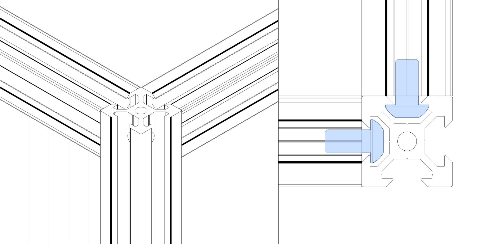
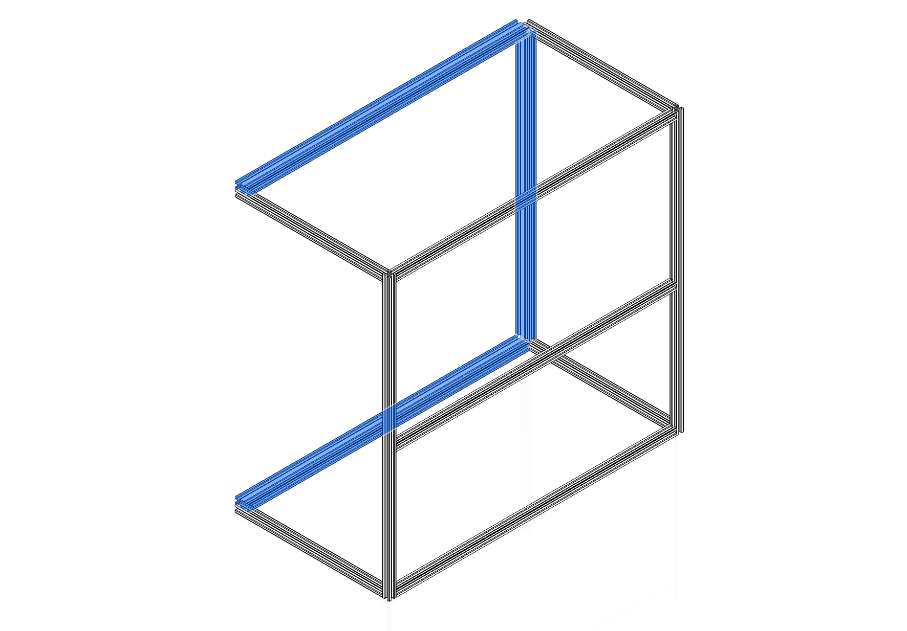
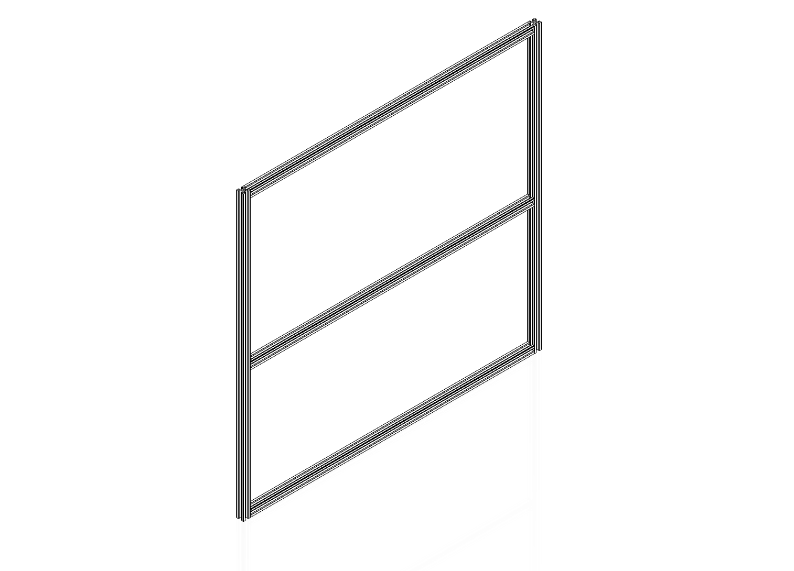
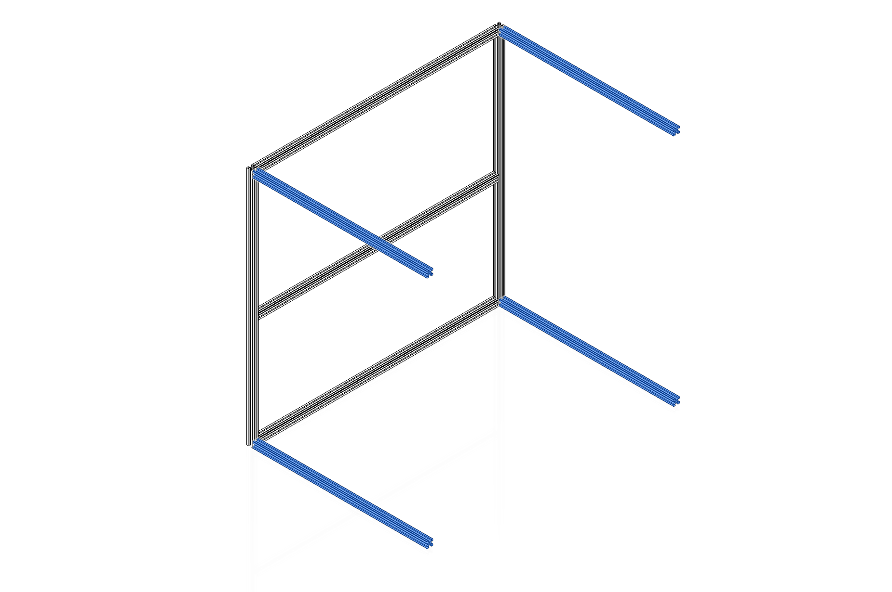
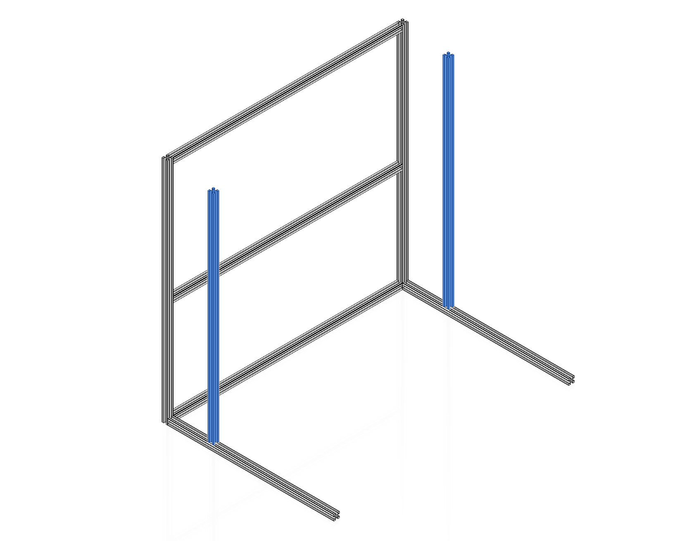
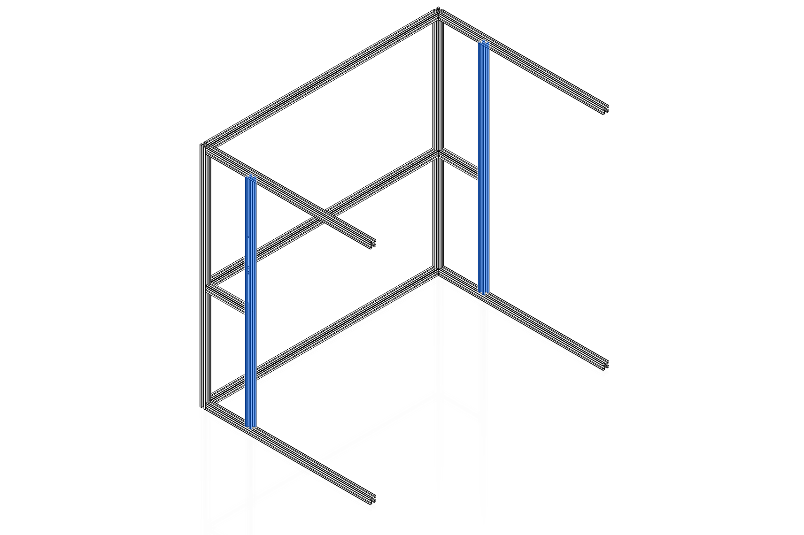
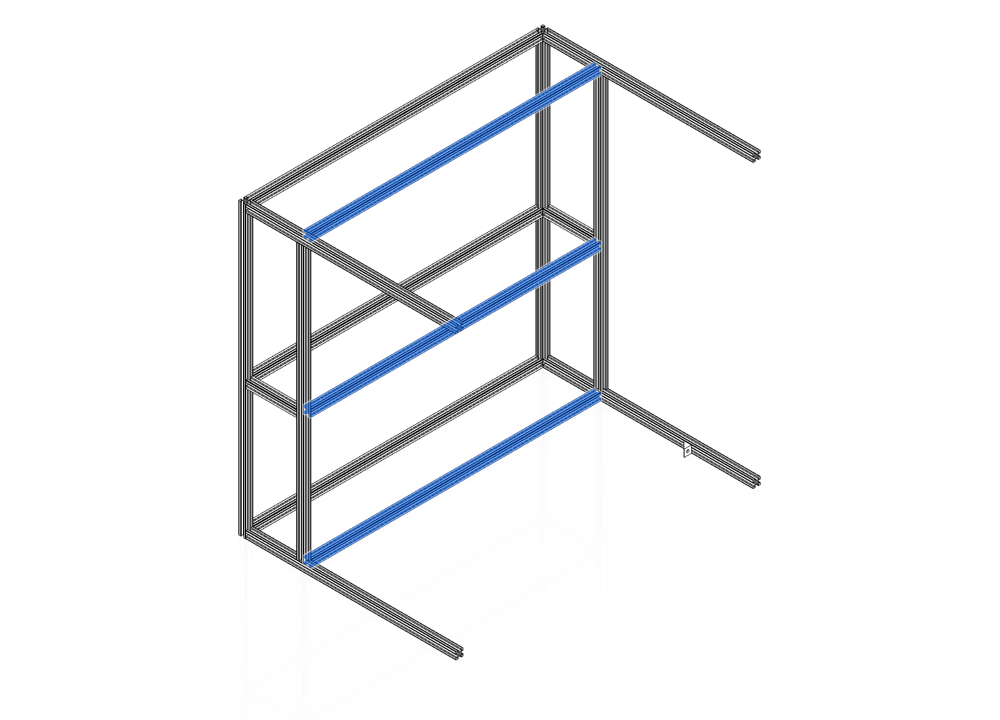
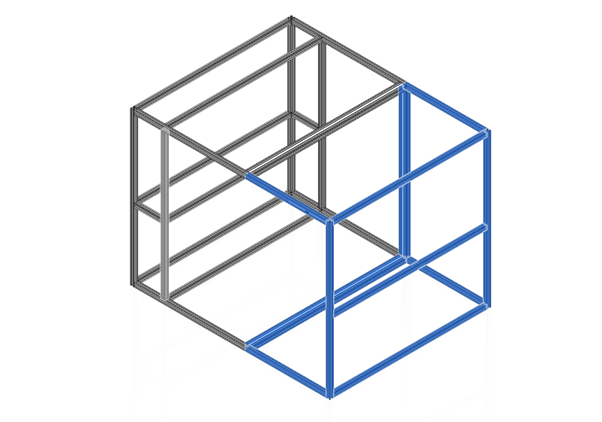

# Outer Frame Assembly

!!! tip "Blind Joints"
    

    The frame of Casa is assembled using blind joints. These are simple and cheap joints that provide excellent strength through metal-to-metal contact. Blind joints require cross drilling the extrusion to allow access to tighten down a button head bolt and also require manual alignment. Make sure that joints are aligned and square when tightening.

[Next Chapter: Sliding Door Assembly](./30_sliding_door_assembly.md)
