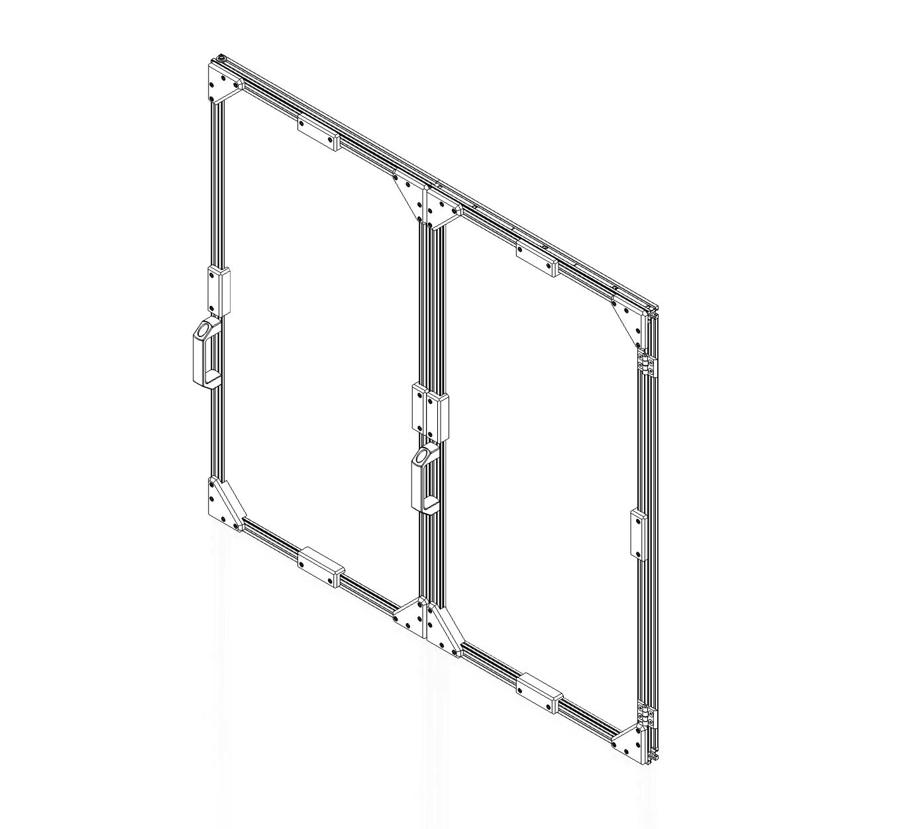
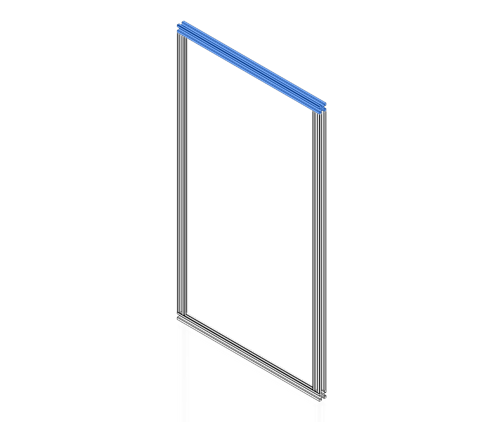

# Sliding Door Assembly



---

!!! info annotate "Components Required"
    ```
        2 x Extrusion I
        1 x Extrusion J
        2 x M5 x 10 BHCS
    ```


---

Slide the panel into the extrusion grooves. It will fit loosely at this stage.
!!! info annotate "Components Required"
    ```
        1 x Panel 390 x 725
    ```


---

!!! info annotate "Components Required"
    ```
        1 x Extrusion J
        2 x M5 x 10 BHCS
    ```


---

Affix panel brackets to the door frame using M3 x 10 SHCS screws.
!!! info annotate "Components Required"
    ```
        4  x Panel Clip A
        2  x Panel Clip K
        20 x M3 x 10 SHCS
    ```


---

Repeat previous steps to create a second door panel.
!!! info annotate "Components Required"
    ```
        2  x Extrusion I
        2  x Extrusion J
        1  x Panel 390 x 725
        4  x Panel Clip A
        2  x Panel Clip K
        4  x M5 x 10 BHCS
        20 x M3 x 10 SHCS
    ```


---

Attach the two door panels using 2020 hinges. Add a second set of hinges to the right-hand edge to attach the door to the machine.
!!! info annotate "Components Required"
    ```
        12 x M5 x 10 FHCS
        4  x 2020 Extrusion Hinge
    ```


---

Affix the two handles with M5 x 10 BHCS.
!!! info annotate "Components Required"
    ```
        2 x Door Handles
        4 x M5 x 10 BHCS
    ```


---

Bolt the doornut to the left end of the door. 
!!! info annotate "Components Required"
    ```
        2 x Doornut Body
        4 x M3 x 10 SHCS
    ```


---

[Next Chapter: Panels and Clips](./30_panels_and_clips.md)