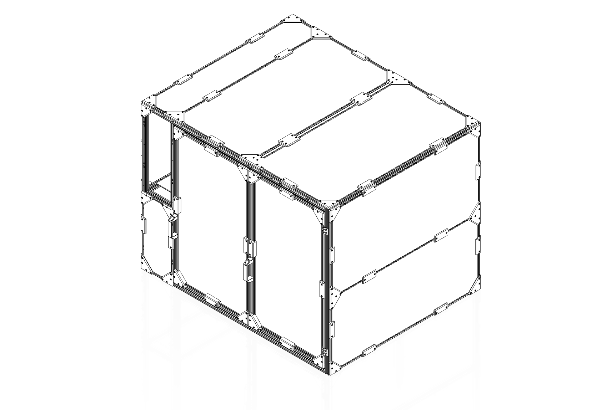
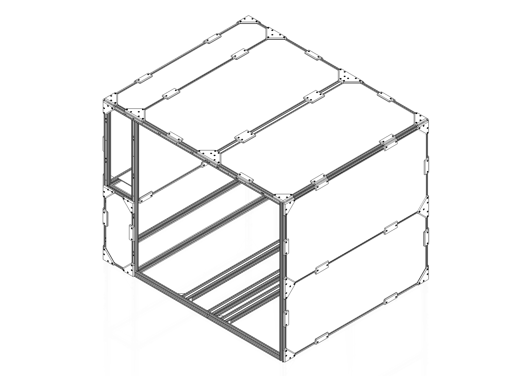
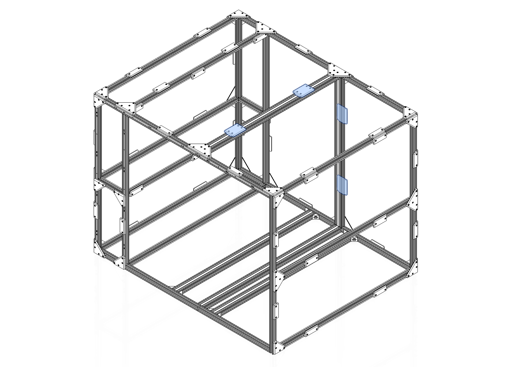

# Panels and Clips

---

Begin by fitting the static panels to the machine. The panels fit over the extrusion and are held in place with printed clips. Each panel should have weather stripping applied to all edges.

!!! note
    Each clip is referred to by a letter. That letter is in the STL file name and printed onto the part itself. Make sure to select the correct clip as many look similar. Always check the letter on the part. Secure with M3 x 10 SHCS screws.

!!! info annotate "Clip B"
    

!!! info annotate "Clip C"
    

!!! info annotate "Clip D"
    

!!! info annotate "Clip E"
    

!!! info annotate "Clip F"
    

!!! info annotate "Clip G"
    

!!! info annotate "Clip H"
    

!!! info annotate "Clip I"
    

!!! info annotate "Clip J"
    

!!! info annotate "Clip L"
    

---

Attach the door to the enclosure. To do this you will need to [pivot](https://imgur.com/pivot-Zei0mk9) the door into place such that the doornuts are located and then "close" it before attaching the hinges to the frame. Secure the hinge with M5 x 8 FHCS screws.

---

[Next Chapter: Electronics](./40_electronics.md)