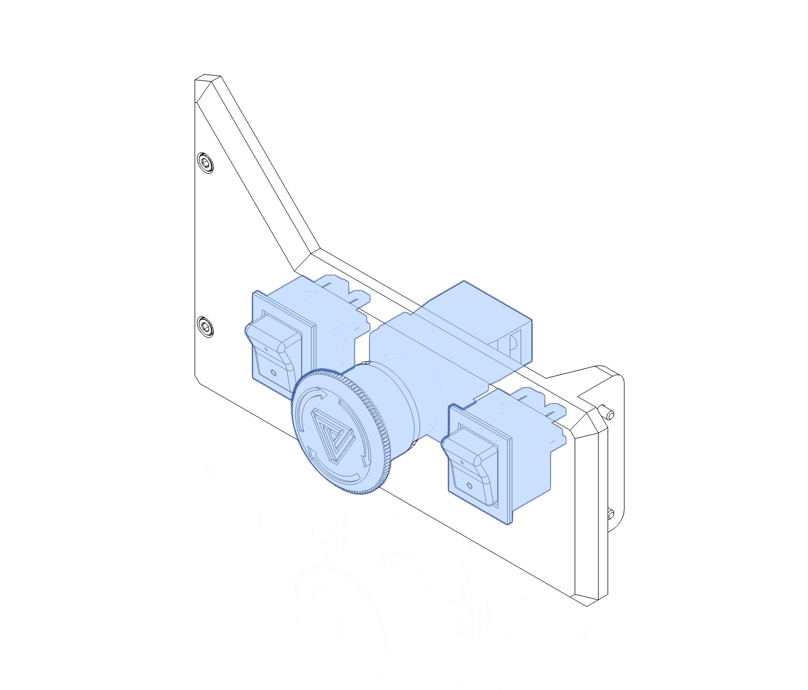
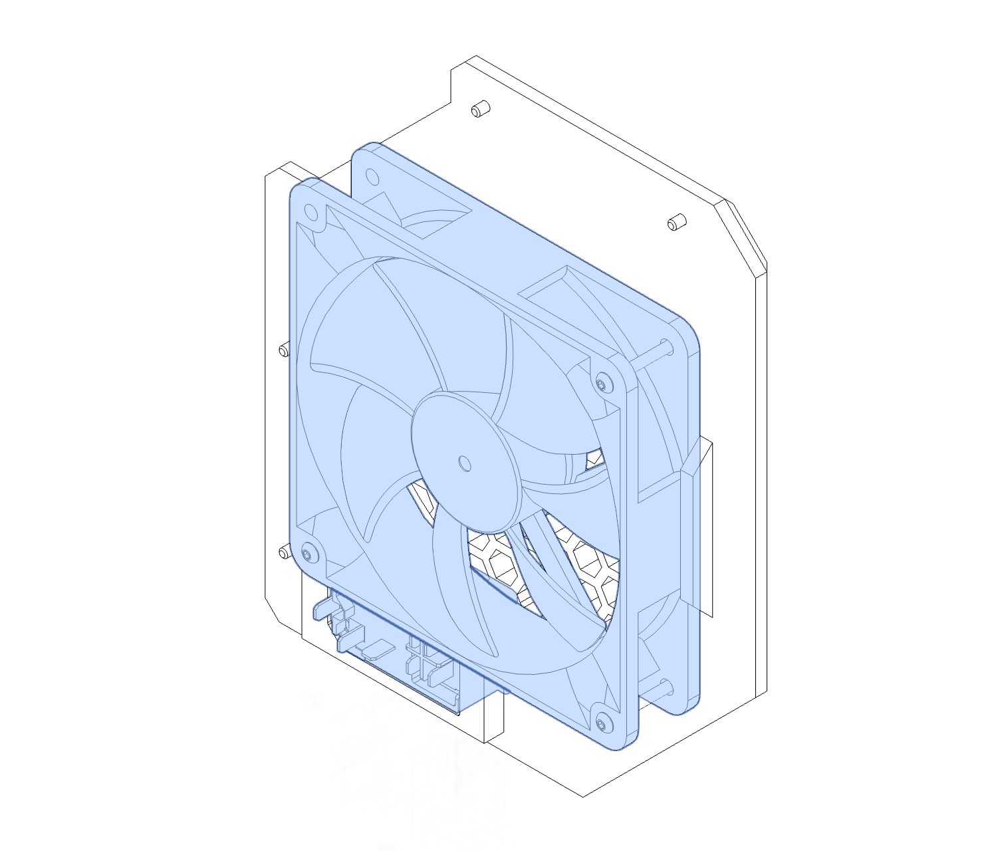
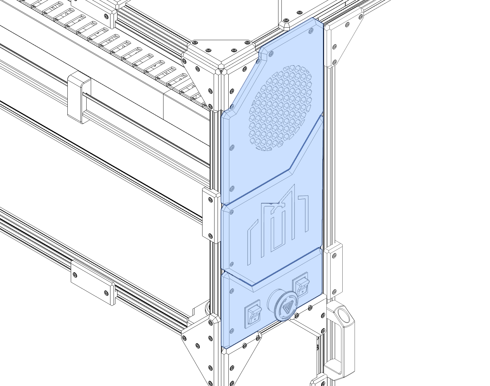

# Electronics Bay


!!! note
    The electronics bay provides space to contain your machines electronics. Due to the unique nature of each machine setup and electronics choices this manual will not attempt to guide you through the fitting or wiring of your electronics. This manual will focus on installing the front and rear I/O panels, the cable entries, the cable guides, and DIN rail mounts.

    

---

## Cable Management and DIN Rails

!!! info annotate "Components Required"
    ```
        ??
    ```


---

!!! info annotate "Components Required"
    ```
        ??
    ```


---

!!! info annotate "Components Required"
    ```
        ??
    ```


---

!!! info annotate "Components Required"
    ```
        ??
    ```


---

!!! info annotate "Components Required"
    ```
        ??
    ```


---

## Passthrough and Base Board


!!! info annotate "Components Required"
    ```
        ??
    ```


---

!!! info annotate "Components Required"
    ```
        ??
    ```


---

!!! info annotate "Components Required"
    ```
        ??
    ```


---

## Front and Rear IO Panels

!!! info annotate "Components Required"
    ```
        2 x Extrusion I
        1 x Extrusion J
        2 x M5 x 10 BHCS
    ```


---

!!! info annotate "Components Required"
    ```
        1 x Rear Inlet Cover
        1 x M3 x 3 Heatset Insert
    ```


---

!!! info annotate "Components Required"
    ```
        1 x IEC Power Inlet
        1 x 120 mm Fan
        3 x M3 x 30 BHCS
    ```


---

!!! info annotate "Components Required"
    ```
        ??
    ```


---

!!! info annotate "Components Required"
    ```
        ??
    ```


---


---

[Next Chapter: Basement](./50_basement.md)