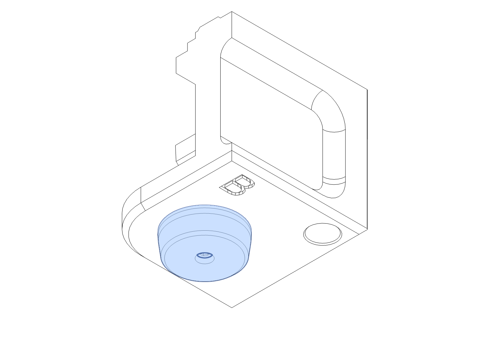
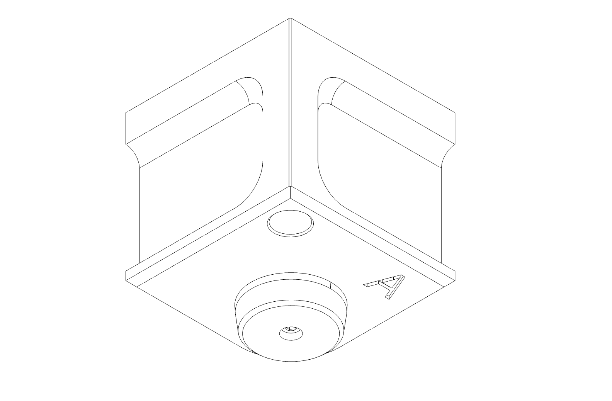

# Basement


---

## Feet

!!! info annotate "Components Required"
    ```
        ??
    ```


---

!!! info annotate "Components Required"
    ```
        ??
    ```


---

!!! info annotate "Components Required"
    ```
        ??
    ```


---

## Skirts

---

## Chip Canal

Install heat set inserts


---

## Chip Pan Panels


---

!!! success ":fontawesome-solid-champagne-glasses: Congratulations!"
    Casa is complete, and you're ready to use your machine, but this time without the chips filling every inch of your space!
    We would love to see your finished build! Please share it on [Discord](https://discord.gg/ya4UUj7ax2) or [Reddit](https://www.reddit.com/r/MilleniumMachines/)!