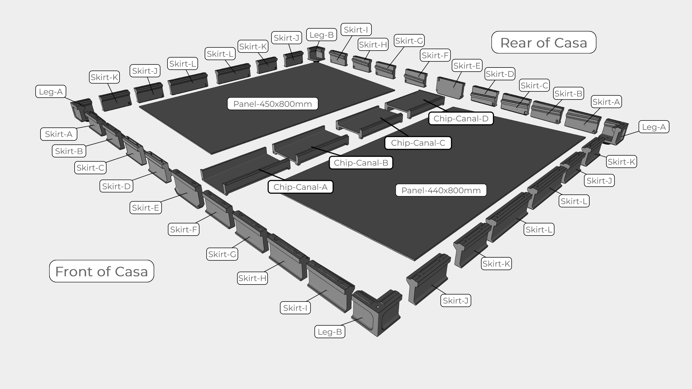
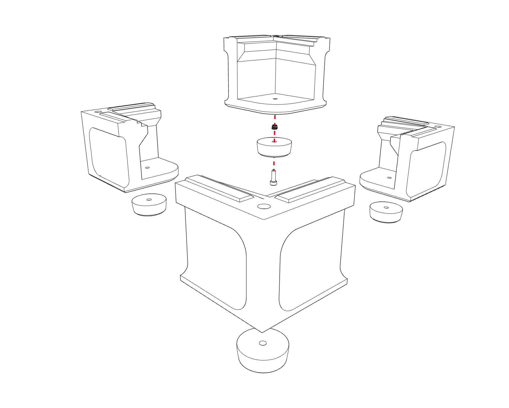
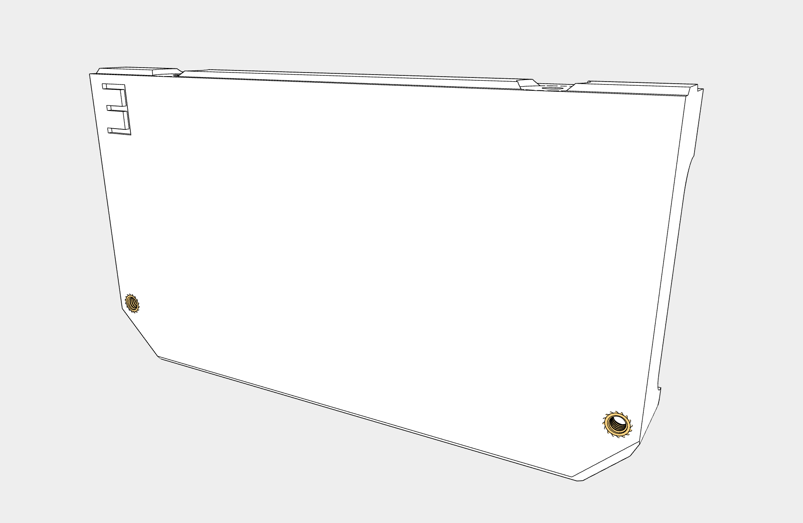
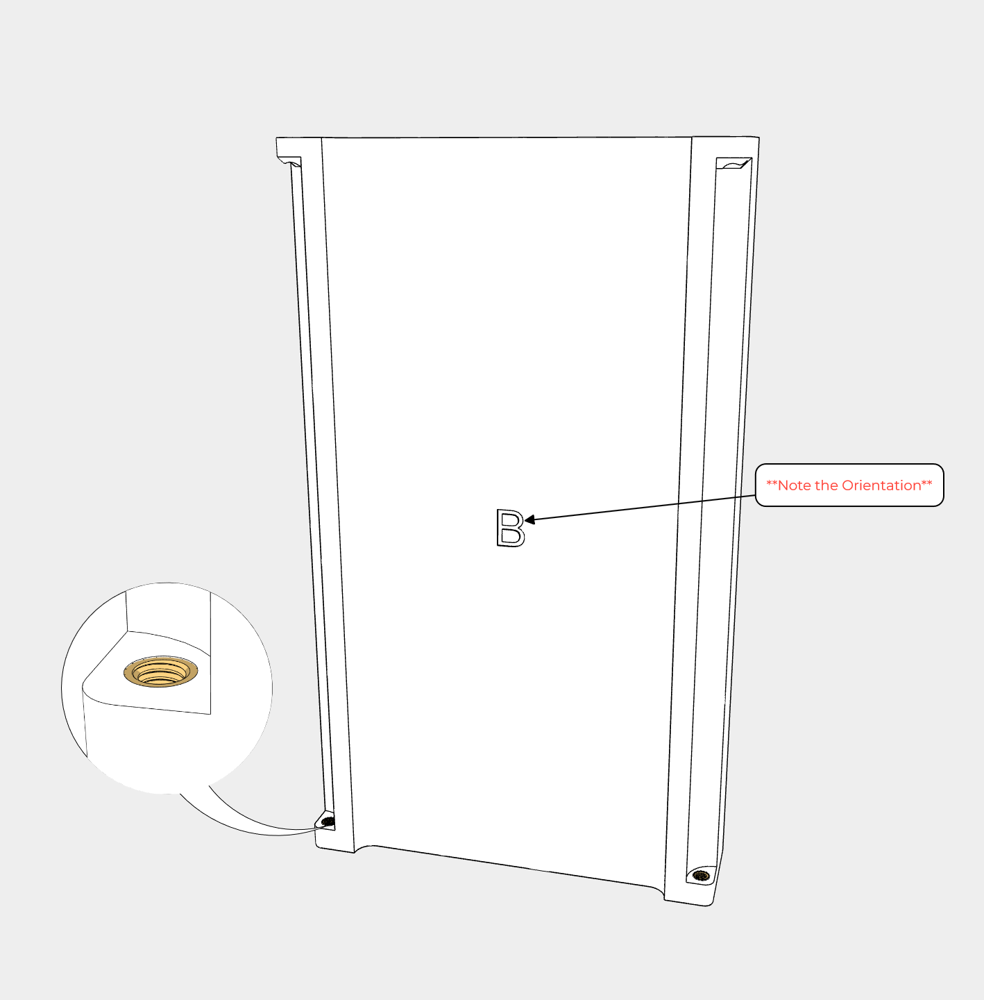
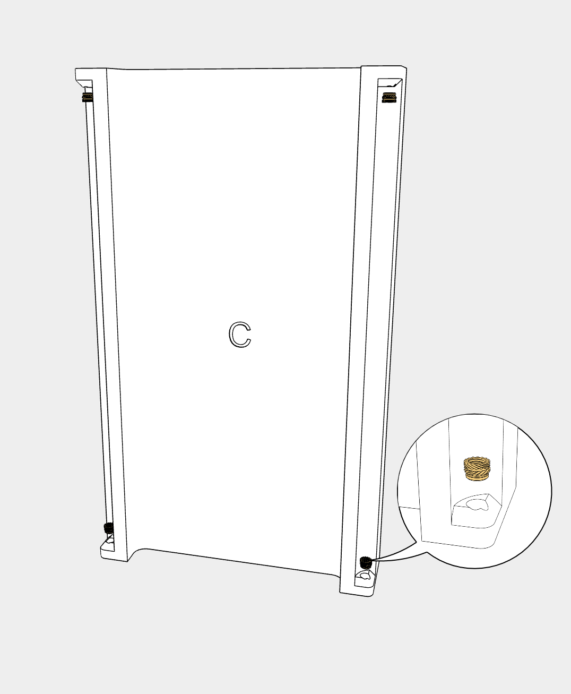
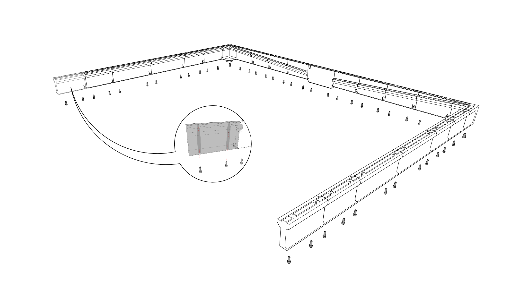
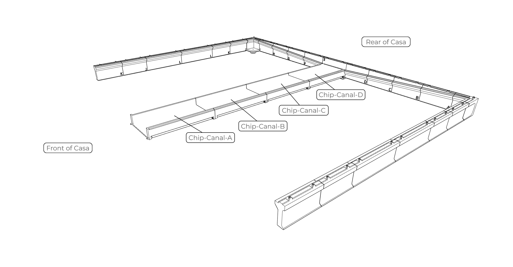
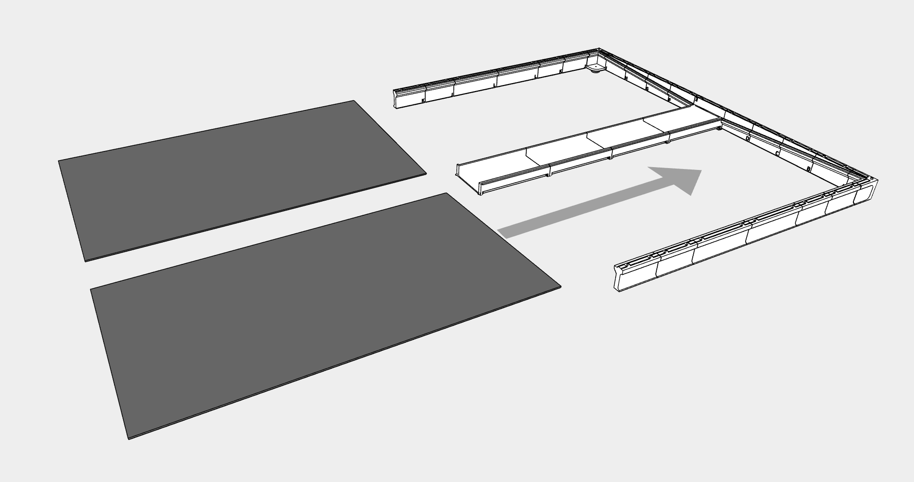

# Basement



---


---

## Feet

!!! info annotate "Components Required"
    ```
        2x Leg A
        2x Leg B
        4x M3x3mm Heat Insert
        4x Rubber Foot
    ```


---

## Skirts

E-Skirt
!!! info annotate "Components Required"
    ```
        2x Skirt E
        4x M3x3mm Heat Insert

    ```


---

## Chip Canal

Chip Canal B
!!! info annotate "Components Required"
    ```
        Chip Canal B
        2x M3x3mm Heat Insert

    ```


---

Chip Canal C
!!! info annotate "Components Required"
    ```
        Chip Canal C
        4x M3x3mm Heat Insert

    ```


---

Chip Canal Assembly
!!! info annotate "Components Required"
    ```
        Chip Canal A
        Chip Canal B
        Chip Canal C
        Chip Canal D
        10x M3x10mm-SHCS

    ```


---

## Assembly


---

!!! info annotate "Components Required"
    ```
        4x Skirt-K
        4x Skirt-J
        4x Skirt-L
        Leg A
        Leg B
        Skirt-A
        Skirt-B
        Skirt-C
        Skirt-D
        Skirt-E
        Skirt-F
        Skirt-G
        Skirt-H
        Skirt-I
        44x M3x12mm-SHCS
        2x M5x10mm-BHCS

    ```



---

!!! note
    Be careful with the Chip Canal until Assembly is complete. 

    

---

!!! info annotate "Components Required"
    ```
        2x Panel 440x800mm

    ```



---

!!! info annotate "Components Required"
    ```
        Leg A
        Leg B
        Skirt-A
        Skirt-B
        Skirt-C
        Skirt-D
        Skirt-E
        Skirt-G
        Skirt-H
        Skirt-I
        18x M3x12mm-SHCS
        2x M5x10mm-BHCS

    ```


---


---

!!! success ":fontawesome-solid-champagne-glasses: Congratulations!"
    Casa is complete, and you're ready to use your machine, but this time without the chips filling every inch of your space!
    We would love to see your finished build! Please share it on [Discord](https://discord.gg/ya4UUj7ax2) or [Reddit](https://www.reddit.com/r/MilleniumMachines/)!