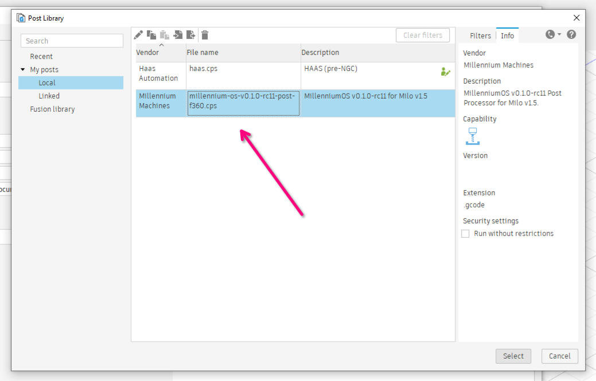

# Installing MillenniumOS

!!! warning "Beta Software"
    MillenniumOS is currently in early public release. It has been tested by early LDO kit owners as well as those who have self-sourced their Milos, and members of the Millennium Machines development team. Please expect bugs and keep a hand near your emergency stop until you are happy that you understand how the system works.

MillenniumOS for RRF is distributed as a **single Zip file** that contains everything needed to understand and support our custom functionality and gcode dialect.

## RRF Installation

!!! note
    If you installed one of our [RRF Configurations](https://github.com/MillenniumMachines/RRF-Configs/releases) that contains MillenniumOS, then you may not need to follow everything in this guide. If you start RRF and a MillenniumOS configuration wizard appears, then MillenniumOS is already installed. It just needs to be [configured](#configuration)!

### Download MillenniumOS Release

MillenniumOS releases are found on the [MillenniumOS Releases](https://github.com/MillenniumMachines/MillenniumOS/releases) page. Select the `mos-release-vX.X.X...zip` file to download the latest release.

{: .shadow-dark }

---

### Upload MillenniumOS files to RepRapFirmware

Once the Zip file has been downloaded, simply upload it to DWC using the **"Files -> System"** tab. Click **"Upload System Files"** (at the top right of the list of files), select the Zip file you downloaded previously (`mos-release-vX.X.X...zip`) and click OK.

{: .shadow-dark }

---

Each of the files from the Zip will be uploaded individually. You can see the list of files being uploaded and there will be a notification when the whole Zip file has been uploaded. Once the upload is complete, click **"Close"**.

{: .shadow-dark }

---

### Load MillenniumOS on startup

!!! tip
    If you are using a supported [RRF Configuration](#rrf-installation) then you can skip to [Configuration](#configuration) as MillenniumOS will be loaded automatically. All you have to do is reboot after uploading the Zip file.

MillenniumOS needs to be loaded on every bootup of your mainboard.

To achieve this, we must add or uncomment a configuration line in your `config.g` file. Navigate to the **"Files -> System"** tab, and click on the `config.g` file to edit it.

Scroll to the bottom, and make sure that the last line in the file looks exactly like this:

```gcode
M98 P"mos.g"
```

If the line is commented - `; M98 P"mos.g"` or `(M98 P"mos.g")` - then remove the comment characters `;` or `(`..`)` from the line to load MillenniumOS on startup.

Once done, click the Save button in the top right.

!!! warning
    As you have changed `config.g`, you may be prompted to **restart** or **reload** the RRF configuration. Pick the **restart** option.

    If you are not prompted, please type `M999` in the **"Control -> Console"** tab and hit enter to restart the mainboard.
    MillenniumOS will not load properly until the machine is restarted.

### Configuration

After restarting, you will be prompted to configure MillenniumOS. This configuration process is guided, so simply read and click through the dialog boxes as they appear.

{: .shadow-dark }

---

#### Configuration Wizard

When prompted to provide information or perform an action, please read the information *carefully* - the configuration wizard will trigger machine movement where necessary, however, you will *always* be warned before this happens.

If you cancel the wizard or receive an error, you can re-run the wizard using `G8000`. Once the wizard is complete your machine will reboot to reload the new settings, at which point MillenniumOS is ready for use.

!!! note "Resuming the Wizard"
    MillenniumOS now supports resuming the wizard if it is not completed. Settings are saved to an intermediate file and loaded when the wizard is started, and you will be prompted to continue where you left off or restart.

If you experience connection issues during the wizard, you can typically reload your browser tab to trigger the next dialog.

!!! tip "Datum Tools"
    You will be asked to select a Datum Tool during the wizard process, which is used to take various manual measurements.

    This tool needs to be able to activate your Toolsetter, if you have one, and a reference surface (usually the machine table near where the Toolsetter is mounted) if you also have a Touch Probe.

    It is generally easier to check this before starting the configuration wizard, as it might involve moving your spindle down in the mount to reach both of these items with a short tool.

    If you realise this during the configuration wizard process, don't worry - you can resume where you left off once fixing the issue.

!!! note
    If you experience connection issues during the wizard, you can reload your browser tab to trigger the next dialog.

You may re-run the wizard anytime to reconfigure one or more features. If you click the **"Update"** button when asked if you want to reset the configuration, you can pick which parts of the configuration you would like to reconfigure. All other parts of the existing configuration will be left as-is.

!!! tip "Touch Probe Deflection"
    If you're using the standard Aliexpress "3D Edge Finder" probes that cost under $100 then it is relatively normal to record a deflection of around 0.2-0.4mm in either axis, even if your backlash is minimised and your machine is properly trammed.

    The deflection on these probes tends to be pretty consistent so the compensation will usually make these accurate enough for our purposes, however, you can re-run the Touch Probe configuration via the Configuration Wizard if you would like to re-calculate the values after making changes to your machine.

!!! tip "Manual Measurements"
    Even if you have a Touch Probe and a Toolsetter, the Wizard will ask you to take a few manual measurements using a Datum tool. This is necessary to enable tool offset compensation when using the Toolsetter and the Touch Probe together.

    In short - we cannot probe the length of the Touch Probe with the Toolsetter (or the other way round, for that matter) because the Touch Probe and Toolsetter require different activation pressures - one will activate before the other, and this will never be accurate enough to measure different tool lengths and offsets.

    The manual measurement calculates the distance between a surface we _can_ probe (using the Touch Probe at the start of every job) and the activation point of the Toolsetter, using a tool whose length does not change between the measurements.

    This gives us a relative distance that can be used to calculate the expected activation point of the Toolsetter when changing tools, the tool _offset_ is the difference between the expected activation point and the actual point the Toolsetter was activated at.

    If you'd like to understand more of how this works, the macro files themselves are quite well commented and easy to read - look at `G8000`, `G37`, `tpre.g` and `tpost.g`.

!!! warning
    If you receive any syntax or other errors during the configuration process, please report these on the [MillenniumOS](https://github.com/MillenniumMachines/MillenniumOS) repository as an issue or ask for assistance on our Discord.

---

#### User Variables

When the configuration wizard completes, it writes the settings to the `mos-user-vars.g` file. This file can be edited by hand but remember, it will be overwritten the next time the configuration wizard is run, so your settings will be lost if you choose to `Reset` these during the wizard.

If you are comfortable editing the configuration file by hand then this can be used for small changes, however, you must remember to reload MillenniumOS after editing (use the `Misc/Reload` macro or run `M9999`).

!!! warning
    Editing the `mos-user-vars.g` file directly is unsupported as it is easy to trigger a syntax error. Only use this method if you are familiar with the RRF meta gcode language and can debug syntax issues yourself.

---

## Post-Processor Installation

After configuring MillenniumOS, the final step is to install the correct post-processor for your CAD/CAM software to enable the software to produce the right gcode for MillenniumOS.

Fusion360 is supported with a `.cps` post-processor. This may work in other Autodesk products but usage outside of Fusion360 is completely untested and out of scope for this documentation.

FreeCAD is supported with a `.py` post-processor.

### Fusion360

#### Download the Post-Processor

Download the `millennium-os-<version>-post-f360.cps` file from the release matching your installed MillenniumOS version.

{: .shadow-dark }

---

#### Download the Machine Definition

You should also download the Fusion360 machine definition as this allows you to configure the post-processor on a per-operation basis for certain settings. These are released alongside the post-processor and RRF Zip file.

You will need to download the file that matches your machine's specification - currently, these are generated for the following specifications:

* Standard: `milo-v1.5-std-v...mch`
    * X=0 to 335mm
    * Y=0 to 208mm
    * Z=0 to -120mm

This can be used with a machine of the standard working area, with either a 60mm or 120mm clearance. This includes the LDO kit.

!!! note
    Refer to the image in the [Post-Processor Installation](#post-processor-installation) section for how these appear on each release.

---

#### Create an NC Program

Switch to the **"MANUFACTURE"** workbench in Fusion360.

{: .shadow }

---

Under the **"Milling"** tab in the top bar, click the **"NC Program"** icon (the one with a G at the top of a document).

{: .shadow }

---

#### Import the post-processor

Click the **"Folder"** icon to the right of Post (**"Select post from the library"**).

{: .shadow }

---

Hit the **"Import"** button (Document with Arrow on the left, facing right).

{: .shadow }

---

Select the `millennium-os-...-f360.cps` file from your filesystem and click "Open" in the bottom right of the window.

{: .shadow }

---

Ensure the newly created "MillenniumOS" post entry is selected in the Post Library and click Select in the bottom right of the window.

{: .shadow }

---

You may now click "OK" on the "NC Program" window to return to the main view.

#### Create a Setup

To install the machine definition, we must first create a **"Setup"**. Click on the **"Setup"** icon under the **"Milling"** tab in the top bar.

{: .shadow }

---

Click **"Select"** on the **"Setup"** tab under the **"Machine"** heading:

{: .shadow }

---

#### Import the machine definition

Click on the **"Import"** button to open the machine definition selection dialog:

{: .shadow }

---

Click **"Select from my computer"** in the bottom left-hand corner of the selection window, and then pick the `.mch` file you downloaded previously.

{: .shadow }

---

!!! note
    The machine file and post-processor are configured and named specifically so that they reference each other. You should load the machine definition after the post-processor, allowing it to find the post-processor file. When successfully linked, you should see a `Post` line under the machine definition indicating that the Machine and post-processor are linked.

{:.shadow }

---

#### Configure the post-processor

Configure the post-processor in the **"Post properties"** section of the **"NC Program"** window to your liking. The default settings should work fine unless you have more advanced needs.

{: .shadow }

---

### FreeCAD

#### Download the Post-Processor

Download the `millennium_os_<version>_post.py` file from the release matching your installed MillenniumOS version.

{: .shadow-dark }

---

#### Install the Post-Processor

You will need to copy this file into your FreeCAD Macro directory.

You can find this directory by going to **Macro -> Macros** from the menu bar and looking at the *User macros location* in the bottom corner of the window.

Once the file is placed there, it will be selectable as the Processor under every *Job* instance from the *Path* workbench.

!!! note
    The FreeCAD post-processor is designed to work with the [Realthunder branch](https://github.com/realthunder/FreeCAD) (otherwise known as the Link branch) of FreeCAD. It may or may not work with stock FreeCAD, depending on which Python version is bundled (the post-processor needs at least 3.11).

    You should consider switching to the Realthunder branch of FreeCAD if you haven't already - it is more stable with complex designs thanks to attempting to fix the [Topological Naming Problem](https://github.com/realthunder/FreeCAD_assembly3/wiki/Topological-Naming).
---

You're finally ready to add some toolpaths and then run the post to generate MillenniumOS-flavoured output gcode. These steps are not MillenniumOS specific and are therefore outside of the scope of this documentation.

If you want to understand how MillenniumOS works and how best to use it, please proceed to the next chapter.

[Next Chapter: Using MillenniumOS](./30_usage.md)

*[WCS]: Work Co-ordinate System
*[RRF]: RepRapFirmware
*[DWC]: Duet Web Control
