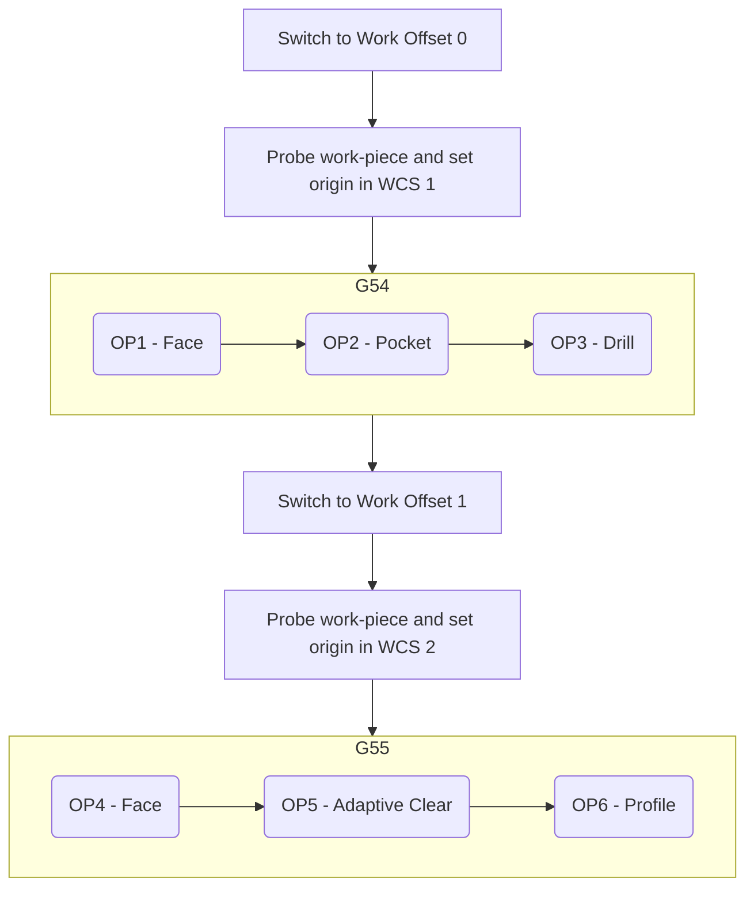
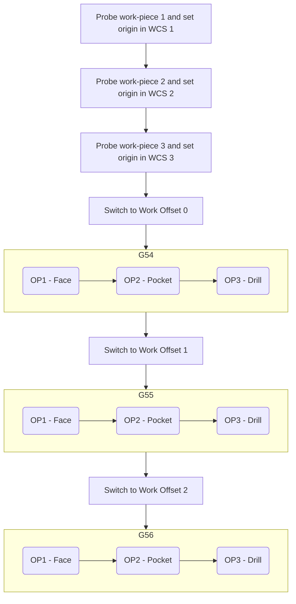
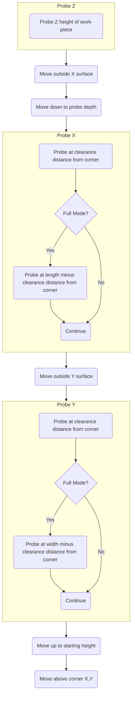
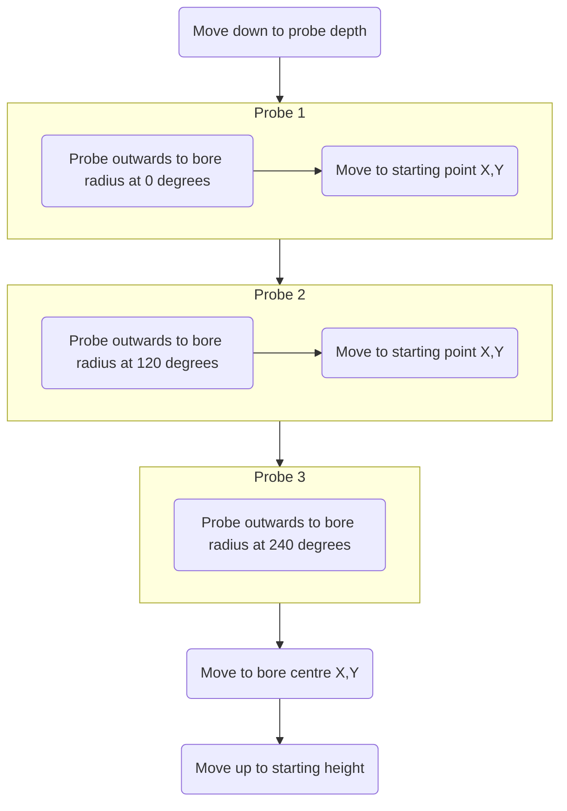
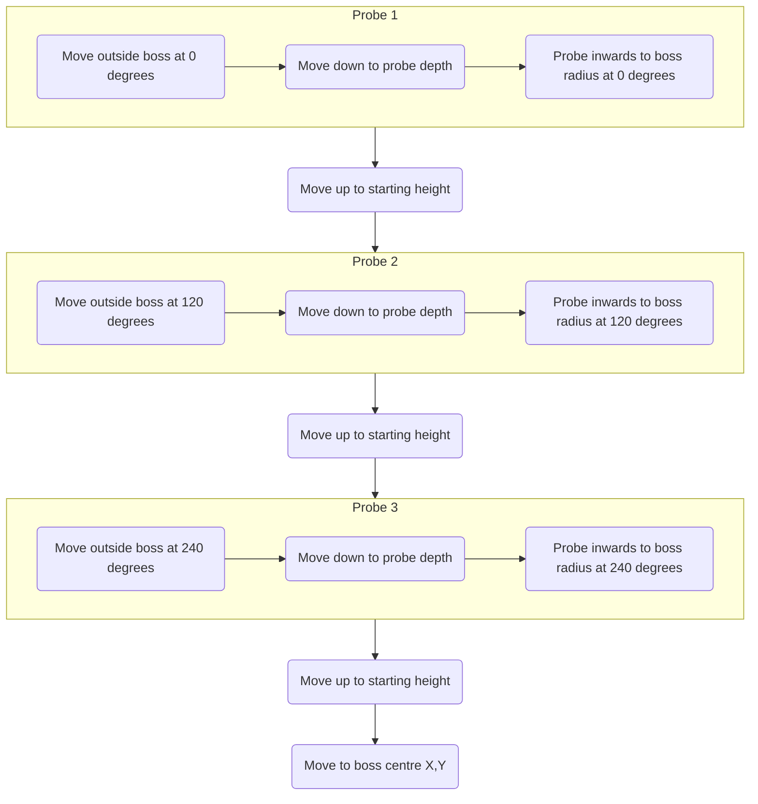
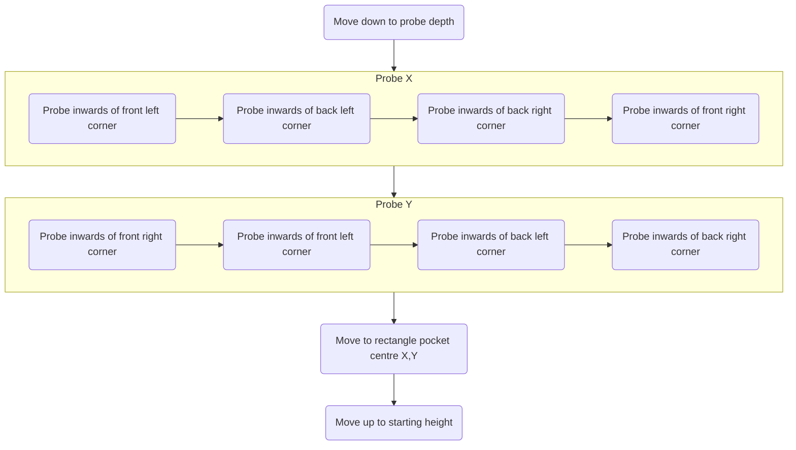
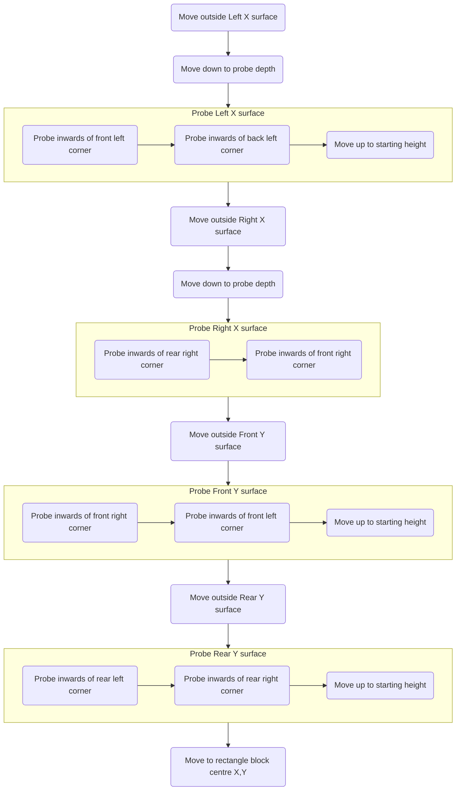
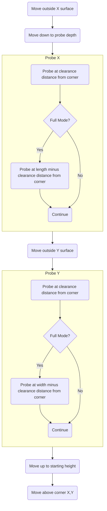
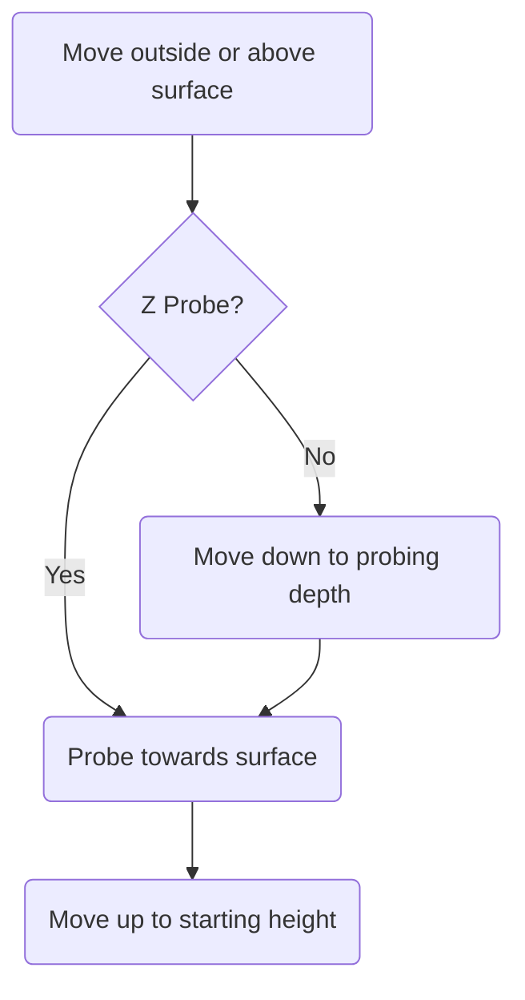
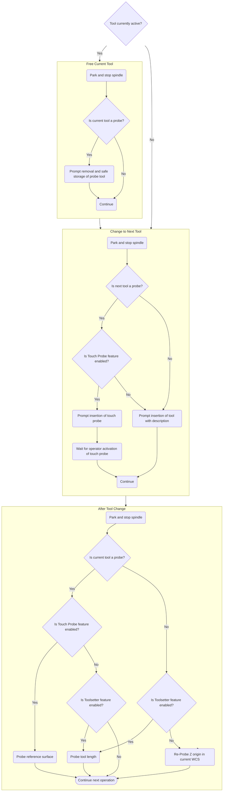

# Using MillenniumOS

At this point, you might have already gained a feeling for how MillenniumOS is designed to work - the Configuration Wizard that starts up after installation *uses* MillenniumOS tool-change and probing procedures to gather the necessary settings, information and measurements to effectively probe work pieces.

That said, there are a number of different probing methods, and the post-processor is not used during the configuration process so it is important to explain how the post-processor and MillenniumOS on RRF interact.

## Post-Processor

The MillenniumOS post-processors are relatively simple - rather than outputting any particularly complex gcode sequences to perform tool changes or probing cycles, they rely on the knowledge that the firmware (RRF, and therefore MillenniumOS macros running on top of it) are best-placed to implement these in a safe manner. The gcode is designed to be simple to read and well commented, so for those of us of a less-trusting nature, it should be easy enough to open in a text editor and understand what it will command your mill to do.

{: .shadow-dark }

---

### WCS Offsets / Work Co-ordinate Systems

The **"WCS offset"** setting of the **"Setup"** selects the WCS that will be switched into prior to running the tool paths configured in the Setup.

A value of `0` in this field corresponds to `G54`, or the *first* WCS. We do not allow output of gcode in machine co-ordinates so this field is zero-indexed. A value of 2 corresponds to `G56`, or the *third* WCS.

The **"WCS offset"** setting can be used in a number of ways.

{: .shadow }

---

#### Single work-piece, multiple operations on different faces

The below flow chart indicates a number of machining operations that are performed on different faces of the same work-piece, e.g. machining the top face of a part, and then flipping it over to machine from the opposite side.



!!! warning
    You can clearly see here the "mismatch" between Fusion360 and RRF / DWC - **Work Offset 0** in Fusion360 corresponds to **WCS 1** in DWC (the offset is *from the first WCS* rather than from *G53, or Machine Co-ordinates*). This is because we do not allow code in machine co-ordinates to be outputted.

    You need to remember this when setting your work offset value in Fusion360 or setting your WCS origins manually.

---

The post-processor defaults to this method of output - this is the **"On Change"** value of the **"WCS Origin Probing Mode"** setting under the **"Probing and inspection"** tab of the **"Post properties"**.

{: .shadow }

With this mode selected, the post-processor will request a work-piece probing cycle for the WCS in question just prior to switching into it.

This is useful for working on a single part where you must rotate the work-piece to machine on multiple faces in sequence. Use the work offset to indicate when a part rotation is necessary, and you can then perform the rotation and probing of the new origin when necessary.

!!! note
    There is currently no way to pass "messages" to RRF to indicate that a work-piece needs to be rotated. You must bear this in mind when producing your tool-paths. When a probing operation is triggered, the spindle will be parked and you will be asked to probe the new WCS. At this point, you should rotate the work-piece and then proceed with the probing steps as indicated.

---

#### Multiple work-piece, multiple operations on a single face of each

The below flow chart indicates running the same machining operations on the same face of multiple work-pieces, e.g. when you want to make 3 identical parts.



---

This flow corresponds to the **"At Start"** value of the **"WCS Origin Probing Mode"** setting under the **"Probing and inspection"** tab of the **"Post properties"**.

{: .shadow }

With this mode selected, the post-processor will identify all work offsets used in the Setup, and trigger a probing cycle for each of them at the start of the gcode.

This is useful where you want to make multiple identical parts - you can select the **"Multiple WCS Offsets"** tick-box on the **"Setup"**, and indicate how many parts to process - Fusion360 will repeat the operations in each WCS that is probed at the start of the file.

### Low-memory Mode

MillenniumOS running on RRF is quite memory intensive - the mainboards that RRF is designed to run with are relatively low powered, and have a small amount of onboard memory that is used for variable storage.

With some chips (in particular the STM32F407, used on the Fly CDYv3 which comes with the LDO kit), we are right at the limits of what is possible based on the complexity of MillenniumOS.

If you are running a job file and the mainboard reboots unexpectedly, you should run `M122` and check under the `=== Platform ===` header - if the `Last software reset` reason is `OutOfMemory`, then this indicates that your mainboard chip did not have enough free memory to make an allocation for something during the processing of the file. This is usually an arc move, where an allocation is made to calculate the movements for the arc.

If you see these errors often, then you can enable `Low Memory Mode` in the post-processor, if available, and this will help to reduce memory usage during file processing by turning any arc moves into linear moves so that RRF does not have to process these internally.

```
Last reset 00:02:25 ago, cause: software
Last software reset at 2024-03-22 16:55, reason: OutOfMemory, Gcodes spinning, available RAM 13468, slot 0
...
```

### FreeCAD

The FreeCAD post-processor supports most of the functionality of the Fusion360 post-processor except low-memory mode (as FreeCAD itself already linearises arc moves), and per-operation support for changing post-processor options (which is a limitation of FreeCAD and can be worked around by using multiple Path Jobs).

One of the big advantages of using FreeCAD is not having any limitations on the number of tools that can be used in a single exported file, and no modification of your rapid speeds like in Fusion360.

The FreeCAD post-processor can be configured in the Job using the following command-line options, but defaults to the same settings as the Fusion360 post-processor.

```output
usage: MillenniumOS v0.2.1-rc2 [-h] [--show-editor | --no-show-editor]
                               [--output-job-setup | --no-output-job-setup]
                               [--output-machine | --no-output-machine]
                               [--output-version | --no-output-version]
                               [--output-tools | --no-output-tools]
                               [--home-before-start | --no-home-before-start]
                               [--probe-at-start | --probe-on-change | --no-probe]
                               [--vssc-period VSSC_PERIOD]
                               [--vssc-variance VSSC_VARIANCE]
                               [--vssc | --no-vssc]

MillenniumOS v0.2.1-rc2 Post Processor for FreeCAD

options:
  -h, --help            show this help message and exit
  --show-editor, --no-show-editor
                        Show gcode in FreeCAD Editor before saving to file.
  --output-job-setup, --no-output-job-setup
                        When enabled, the post-processor will output
                        supplemental commands to make sure the machine is
                        properly configured before starting a job. These
                        commands include homing the machine, probing and
                        zeroing any used WCSs. Individual supplemental
                        commands can be enabled, disabled and configured
                        separately but disabling this allows advanced
                        operators to setup the machine for the job using their
                        own workflow, while still outputting known-good
                        operation gcode from this post.
  --output-machine, --no-output-machine
                        Output machine settings header.
  --output-version, --no-output-version
                        Output version details header.
  --output-tools, --no-output-tools
                        Output tool details. Disabling this will make tool
                        changes much harder!
  --home-before-start, --no-home-before-start
                        When enabled, machine will home in X, Y and Z
                        directions prior to executing any operations.
  --probe-at-start      When enabled, MillenniumOS will probe a work-piece in
                        each used WCS prior to executing any operations.
  --probe-on-change     When enabled, MillenniumOS will probe a work-piece
                        just prior to switching into each used WCS.
  --no-probe
  --vssc-period VSSC_PERIOD
                        Period over which RPM is varied up and down when VSSC
                        is enabled, in milliseconds.
  --vssc-variance VSSC_VARIANCE
                        Variance around target RPM to vary Spindle speed when
                        VSSC is enabled, in RPM.
  --vssc, --no-vssc     When enabled, spindle speed is varied between an upper
                        and lower limit surrounding the requested RPM which
                        helps to avoid harmonic resonance between tool and
                        work piece.
```

---

## Probing

One of the fundamental parts of setting up your job is identifying the origin point of the work co-ordinate system that your job will run in. How this is done depends on the shape of your stock, the design of the item you are planning to machine, and the order of the operations that will be executed on it.

This is not a decision that MillenniumOS can make for you automatically, but it can help you by automating the process of probing the origin of the WCS based on information you give it.

During the execution of a job, and with default post-processor settings, you will be asked just prior to switching into each WCS to probe the origin of that WCS if it is not already set. MillenniumOS will give you a choice of probing cycles to choose from, which are described below. You can pick one or more of these options in sequence to probe the origin of your work-piece in all 3 axes.

For advanced usage, you can switch the **"WCS Origin Probing Mode"** to **"None"**, and this will not automatically trigger a probing cycle of each WCS, either at the beginning of the job or just prior to switching into the WCS. You will need to either set the WCS origin manually or Use the features of your CAM or post-processor to inject probing cycle calls where necessary.

When a probe cycle is triggered, you will see the following dialog box, which allows you to select the probing cycle that you would like to use to zero the WCS in question.

{: .shadow-dark }

<!--
    NOTE: Headings in this section at depth 3 create anchors that are linked to by
    dialogs in MillenniumOS on RRF itself. DO NOT CHANGE THESE HEADINGS UNLESS THE
    LINKS IN THE SOURCE HAVE BEEN UPDATED FIRST!
-->

### Vise Corner

Vise corner is selected by default, as it is likely to be the most-used probing cycle type. With a single probe cycle, it sets a WCS origin in X, Y and Z axes to the top surface of an outside corner of a part.

!!! note
    When using Quick mode (`Q1`), Vise Corner cannot calculate the squareness or rotation of the work-piece, so it will not be possible to compensate for a misaligned part.

    The corner of the part is assumed to be at the exact intersection of 2 lines drawn perpendicular to each axis through the probe points. If your work-piece is not square with the axes, or the corner itself is not square, then the calculated location will be inaccurate.




### Circular Bore

Circular bore finds the X and Y co-ordinates of the centre of a circular bore (hole) in a work-piece by moving downwards into the bore from an operator-chosen approximate centre-point, then probing outwards in 3 directions to the approximate radius of the bore, plus an overtravel amount. You will be asked to enter the following information:

* **Bore Diameter** - Approximate diameter of the bore, used to calculate target probe points.
* **Overtravel** - Added to the bore diameter, accounting for any innaccuracy in the operator-chosen centre-point of the bore. If the probe is not activated after travelling `radius + overtravel` from the operator-chosen centre-point of the bore then the probe cycle will return an error.
* **Approximate Centre-Point** - You will be prompted to jog the probe or datum tool over the approximate centre-point of the bore.
* **Probe Depth** - The depth from the operator-chosen centre-point to descend to, before moving outwards to detect the bore circumference.

Circular bore sets a WCS origin in X and Y axes to the centre of the bore. This is usually used to zero off a hole in a partly-machined work-piece, or off a similar feature in a fixture plate.



### Circular Boss

Circular boss finds the X and Y co-ordinates of the centre of a circular boss (protruding feature) on a work-piece by moving outside the expected diameter of the boss by the clearance distance, then descending to a probing depth from the current Z position and probing back towards the approximate centre of the boss until the probe is triggered.

It then backs off, lifts up above the top surface of the boss and repeats this cycle in another 2 locations around the boss to generate a centre point. You will be asked to enter the following information:

* **Boss Diameter** - Approximate diameter of the boss, used to calculate start and target probe points.
* **Clearance** - Added to the boss radius, this is how far the probe cycle will move outside of the expected surface of the boss before probing back towards the surface.
* **Overtravel** - Subtracted from the boss radius, accounting for any innaccuracy in the operator-chosen centre-point of the boss. If the probe is not activated after travelling `clearance + overtravel` towards the operator-chosen centre-point of the boss from the starting location, then the probe cycle will return an error.
* **Approximate Centre-Point** - You will be prompted to jog the probe or datum tool over the approximate centre-point of the boss.
* **Probe Depth** - The depth from the operator-chosen centre-point to descend to, after moving outwards to each boss probe location, before probing back towards the centre-point.

Circular boss sets a WCS origin in X and Y axes to the centre of the boss. This can be used to zero to the centre of a circular work-piece, or a previously-machined circular feature that protrudes from the work-piece surface.



### Rectangle Pocket

Rectangle pocket sets a WCS origin in X and Y axes to the centre of a rectangular pocket (subtractive feature) in a work-piece. This is likely to be a previously machined feature. This can be used on pockets that have corner radiuses in X and Y, as long as the clearance distance is higher than the corner radius (so the probe is only triggering against 'flat' surfaces).



### Rectangle Block

Rectangle block sets a WCS origin in X and Y axes to the centre of a rectangular block (protruding feature or a rectangular work-piece itself). This probing cycle is additionally useful for measurement, as it can be used to calibrate touch probes or accurately measure the dimensions of a work-piece.



### Outside Corner

Outside corner sets a WCS origin in X and Y axes to the corner of a rectangular work-piece. It is already used by the vise-corner probe cycle, so should only be used in isolation when you need to zero the Z axis somewhere other than the top surface of the work-piece.

!!! note
    When using Quick mode (`Q1`), Outside Corner cannot calculate the squareness or rotation of the work-piece, so it will not be possible to compensate for a misaligned part.

    The corner of the part is assumed to be at the exact intersection of 2 lines drawn perpendicular to each axis through the probe points. If your work-piece is not square with the axes, or the corner itself is not square, then the calculated location will be inaccurate.

<!-- This is essentially a copy-paste from Vise Corner with the Z probe removed -->


### Single Surface

Single surface can either be used 3 times to probe X, Y and Z axes individually as single points, or to "top up" with a Z probe after using one of the X,Y probe cycles above.



!!! note
    Single surface only probes at a single location. This means it is not possible to estimate the angle of a surface, for example to check if a work-piece is rotated and not aligned with the X or Y axis. It should only be used against surfaces that are known-flat, or surfaces that are *going to be made flat* (in respect to the mounting of the work-piece against the table).

## Tool Changes

As with probing, you will have already experienced a guided tool-change using MillenniumOS when running through the Configuration Wizard. The post-processors supplied with MillenniumOS use the `M4000` command to pass details about the tools required to run a job.

This means that your CAD/CAM program becomes the single source of truth for your tool list, and it can vary based on the job being run.

!!! warning
    The Datum tool and optional Touch Probe you would have chosen during the Configuration Wizard are created and managed by MillenniumOS on each boot. This is important because we need to track the radius and deflection of the Touch Probe or Datum tool for accurate probing results.

    These probe tools exist as a single entry in the tool table, depending on if the Touch Probe feature is enabled or not. Please do *not* delete this probe tool, or overwrite its index with another tool.

    Probe tools should always exist in the last index of the RRF tool table which is usually ID 49.

At the start of every gcode file, the used tools will be outputted.

When RRF sees a tool change request (`T<N>`, where `<N>` is the tool number), it will trigger the inbuilt RRF tool-change process which calls our custom implementations of `tfree.g`, `tpre.g` and `tpost.g`.



!!! warning
    Any errors that occur during the tool change will abort the entire job that the tool change ran in. This is important, because a failed tool change leaves the machine in an inconsistent state and further machining could cause damage to your tool, work-piece, yourself or your machine.

    Machining is not like 3D printing in one very important aspect - stopping a job does not automatically make your work-piece unrecoverable. It is better to abort for safety purposes and allow you, the operator, to re-run the job or tool change again.

## Variable Spindle Speed Control

This feature is enabled by default, and will adjust the spindle speed up and down within a small range to avoid resonance building up between the work-piece and tool. Disabling this is likely to have a negative impact on machining quality, but the settings can be tweaked through the post-processor properties and it can also be turned on and off and configured for each operation when using the Fusion360 post-processor.

When VSSC is active, you may be able to hear the spindle speeding up and slowing down on a regular interval. This is intended.

VSSC has a `Period` (`P...`) and a `Variance` (`V...`) - the spindle speed is adjusted around the target RPM in a wave, where the peak of the wave is half the Variance above the target RPM and the trough of the wave is half the Variance below the target RPM.

The Period is the length of one full wavelength, or in other words, a change in speed from the target RPM up to the peak RPM, down to the trough RPM and back to the target RPM will take `P...` milliseconds.

*[WCS]: Work Co-ordinate System
*[RRF]: RepRapFirmware
*[DWC]: Duet Web Control
*[VSSC]: Variable Spindle Speed Control
