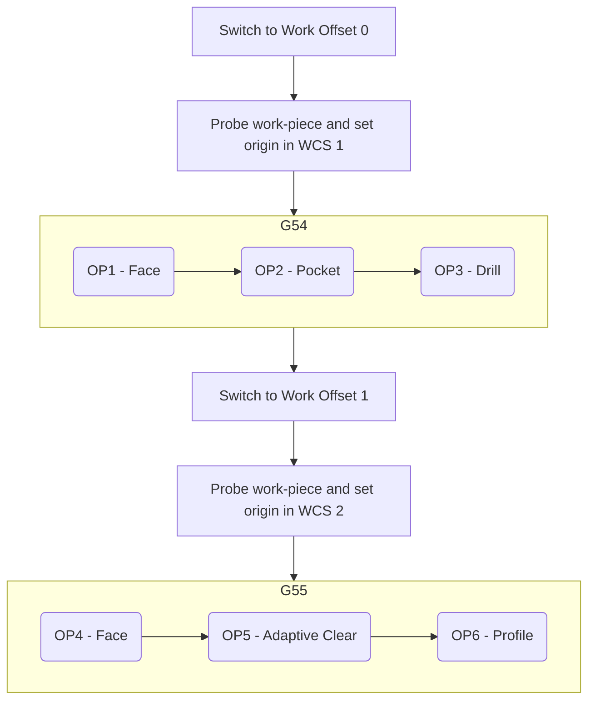
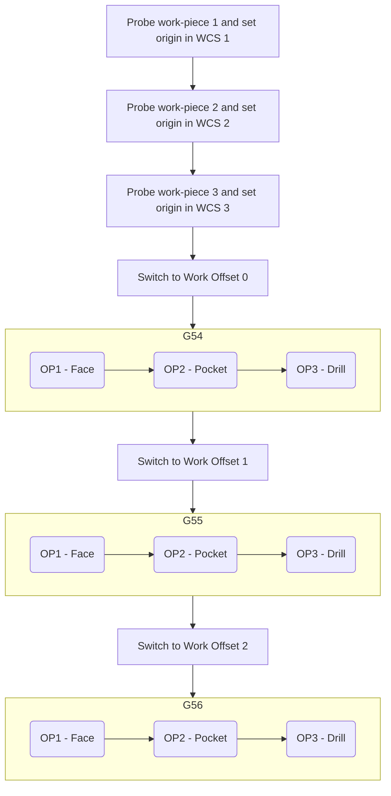
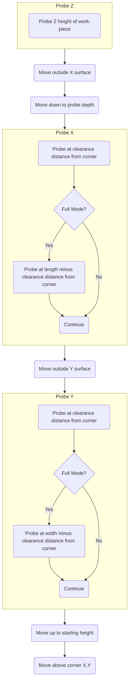
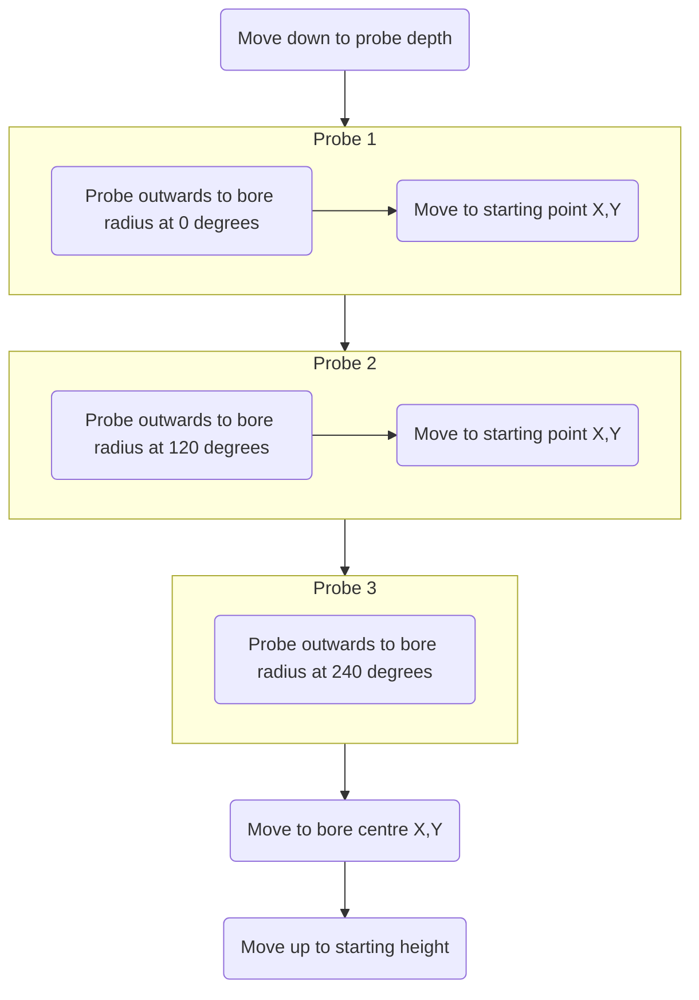
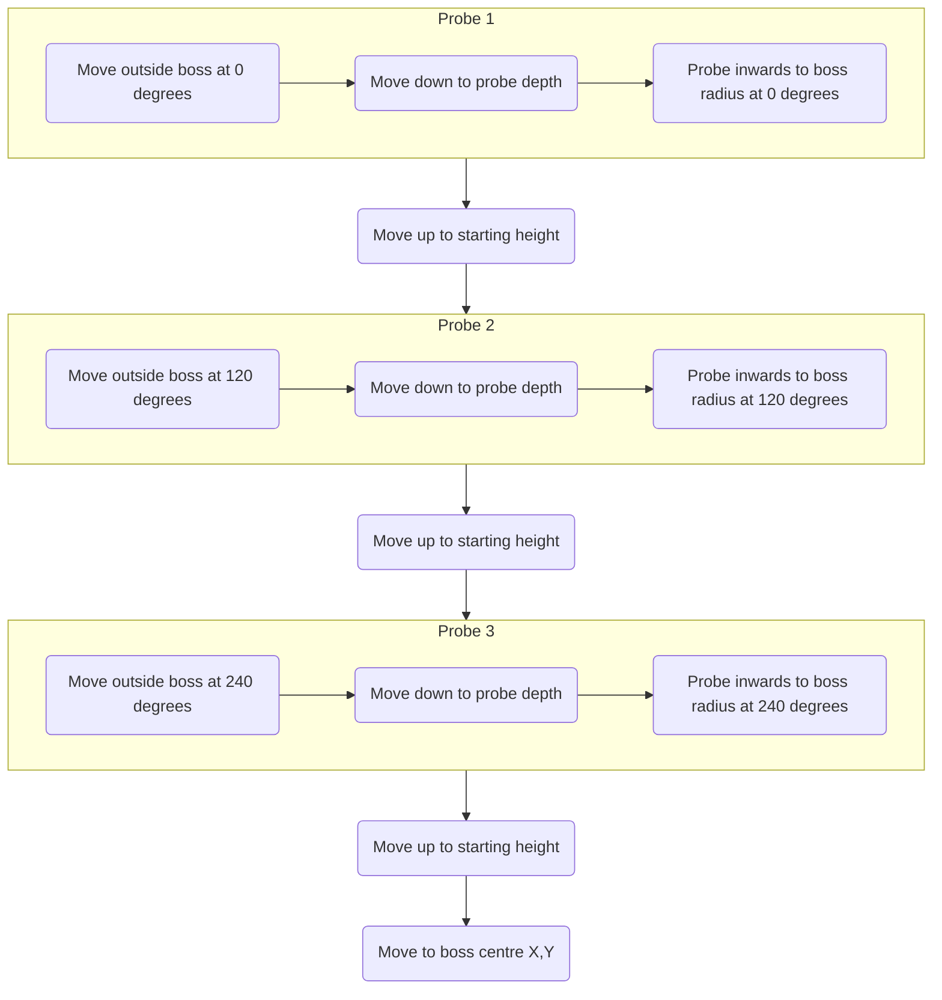
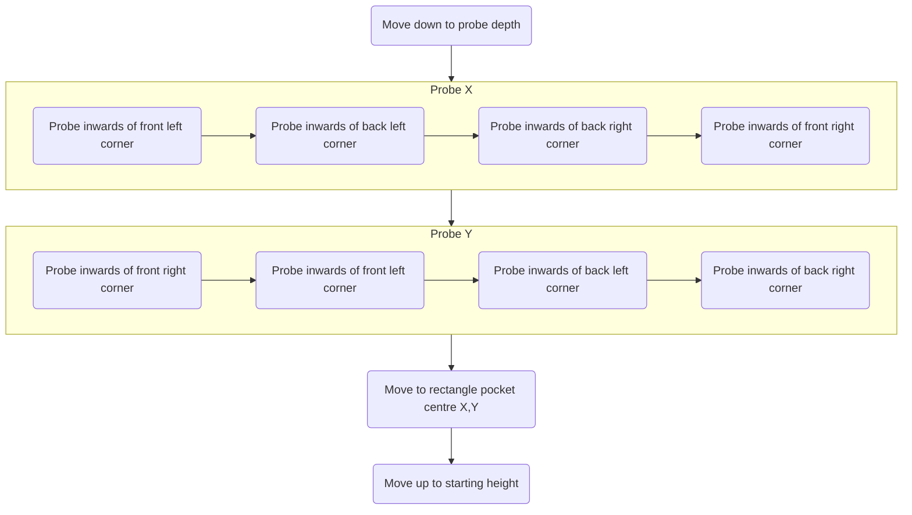
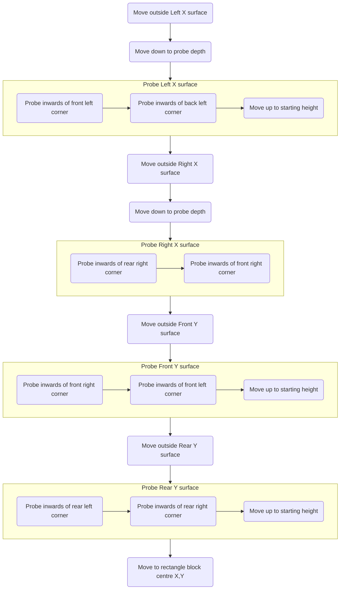
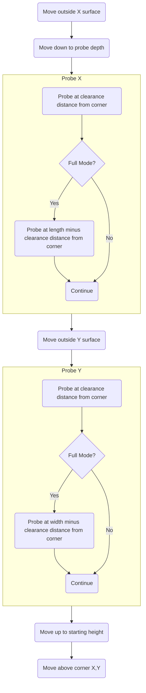
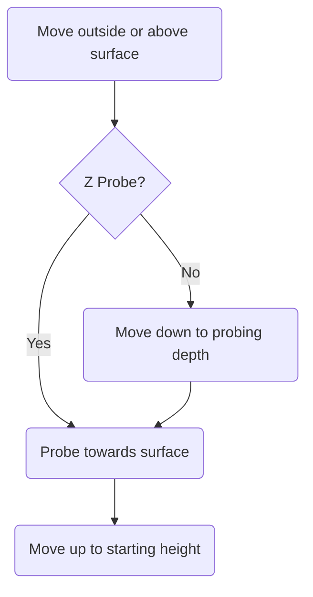

# Using MillenniumOS

At this point, you might have already gained a feeling for how MillenniumOS is designed to work - the Configuration Wizard that starts up after installation *uses* MillenniumOS tool-change and probing procedures to gather the necessary settings, information, and measurements to effectively probe work pieces.

That said, there are several different probing methods, and the post-processor is not used during the configuration process, so it is important to explain how the post-processor and MillenniumOS on RRF interact.

## Post-Processor

The MillenniumOS post-processors are relatively simple - rather than outputting any particularly complex gcode sequences to perform tool changes or probing cycles, they rely on the knowledge that the firmware (RRF, and therefore MillenniumOS macros running on top of it) are best placed to implement these safely. The gcode is designed to be simple to read and well commented, so for those with a less-trusting nature, it should be easy enough to open in a text editor and understand what it will command your mill to do.

{: .shadow-dark }

---

### WCS Offsets / Work Co-ordinate Systems

The **"WCS offset"** setting of the **"Setup"** selects the WCS that will be switched into before running the tool paths configured in the Setup.

A value of `0` in this field corresponds to `G54`, or the *first* WCS. We do not allow the output of gcode in machine coordinates so this field is zero-indexed. A value of 2 corresponds to `G56`, or the *third* WCS.

The **"WCS offset"** setting can be used in several ways.

{: .shadow }

---

#### Single work-piece, multiple operations on different faces

The below flow chart indicates several machining operations that are performed on different faces of the same workpiece, e.g. machining the top face of a part, and then flipping it over to the machine from the opposite side.



!!! warning
 You can see here the "mismatch" between Fusion360 and RRF / DWC - **Work Offset 0** in Fusion360 corresponds to **WCS 1** in DWC (the offset is *from the first WCS* rather than from *G53, or Machine Co-ordinates*). This is because we do not allow code in machine coordinates to be outputted.

 You must remember this when setting your work offset value in Fusion360 or setting your WCS origins manually.

---

The post-processor defaults to this method of output - this is the **"On Change"** value of the **"WCS Origin Probing Mode"** setting under the **"Probing and inspection"** tab of the **"Post properties"**.

{: .shadow }

With this mode selected, the post-processor will request a work-piece probing cycle for the requested WCS before switching to it.

This is useful for working on a single part where you must rotate the workpiece to machine on multiple faces in sequence. Use the work offset to indicate when a part rotation is necessary, and you can then perform the rotation and probing of the new origin when necessary.

!!! note
    There is currently no way to pass "messages" to RRF to indicate that a workpiece needs to be rotated. You must bear this in mind when producing your tool paths. When a probing operation is triggered, the spindle will be parked and you will be asked to probe the new WCS. At this point, you should rotate the workpiece and proceed with the probing steps as indicated.

---

#### Multiple work-piece, multiple operations on a single face of each

The below flow chart indicates running the same machining operations on the same face of multiple work-pieces, e.g. when you want to make 3 identical parts.



---

This flow corresponds to the **"At Start"** value of the **"WCS Origin Probing Mode"** setting under the **"Probing and inspection"** tab of the **"Post properties"**.

{: .shadow }

With this mode selected, the post-processor will identify all work offsets used in the Setup, and trigger a probing cycle for each of them at the start of the gcode.

This is useful where you want to make multiple identical parts - you can select the **"Multiple WCS Offsets"** tick-box on the **"Setup"**, and indicate how many parts to process - Fusion360 will repeat the operations in each WCS that is probed at the start of the file.

### Low-memory Mode

Running MillenniumOS on RRF is quite memory intensive - the mainboards that RRF is designed to run with are relatively low-powered, and have a small amount of onboard memory for variable storage.

With some chips (in particular the STM32F407, used on the Fly CDYv3 which comes with the LDO kit), we are right at the limits of what is possible based on the complexity of MillenniumOS.

If you are running a job file and the mainboard reboots unexpectedly, you should run `M122` and check under the `=== Platform ===` header - if the `Last software reset` reason is `OutOfMemory`, then this indicates that your mainboard chip did not have enough free memory to allocate something during the processing of the file. This is usually an arc move, where an allocation is made to calculate the movements for the arc.

If you see these errors often, then you can enable `Low Memory Mode` in the post-processor, if available, and this will help to reduce memory usage during file processing by turning any arc moves into linear moves so that RRF does not have to process these internally.

```output
Last reset 00:02:25 ago, cause: software
Last software reset at 2024-03-22 16:55, reason: OutOfMemory, Gcodes spinning, available RAM 13468, slot 0
...
```

### Combining Multiple Operations

One of the most painful Fusion360 limitations, when you don't have a subscription, is not being able to export a single file that uses multiple tools.

You can get around this by exporting each set of operations using the same tool individually, and then combining them after using a text editor or similar. To simplify this process, you should turn off **"Output job setup commands"** for all but the first exported file, which will skip any homing or probing cycles that normally occur at the start of each file.

Probing will still be triggered before switching into a new WCS, and the tools will still be outputted before they are needed, but the machine will not re-home or run any probing cycles at the start of each new set of operations.

### FreeCAD

The FreeCAD post-processor supports most of the functionality of the Fusion360 post-processor except low-memory mode (as FreeCAD itself already linearizes arc moves), and per-operation support for changing post-processor options (which is a limitation of FreeCAD and can be worked around by using multiple Path Jobs).

One of the big advantages of using FreeCAD is not having any limitations on the number of tools that can be used in a single exported file, and no modification of your rapid speeds like in Fusion360.

The FreeCAD post-processor can be configured in the Job using the following command-line options but defaults to the same settings as the Fusion360 post-processor.

```output
usage: MillenniumOS v0.2.1-rc2 [-h] [--show-editor | --no-show-editor]
                               [--output-job-setup | --no-output-job-setup]
                               [--output-machine | --no-output-machine]
                               [--output-version | --no-output-version]
                               [--output-tools | --no-output-tools]
                               [--home-before-start | --no-home-before-start]
                               [--probe-at-start | --probe-on-change | --no-probe]
                               [--vssc-period VSSC_PERIOD]
                               [--vssc-variance VSSC_VARIANCE]
                               [--vssc | --no-vssc]

MillenniumOS v0.2.1-rc2 Post Processor for FreeCAD

options:
  -h, --help            show this help message and exit
  --show-editor, --no-show-editor
                        Show gcode in FreeCAD Editor before saving to file.
  --output-job-setup, --no-output-job-setup
                        When enabled, the post-processor will output
                        supplemental commands to ensure the machine is
                        properly configured before starting a job. These
                        commands include homing the machine, probing, and
                        zeroing any used WCSs. Individual supplemental
                        commands can be enabled, disabled, and configured
                        separately, however, disabling this allows advanced
                        operators to set up the machine for the job using their
                        workflow, while still outputting known good
                        operation gcode from this post.
  --output-machine, --no-output-machine
                        Output machine settings header.
  --output-version, --no-output-version
                        Output version details header.
  --output-tools, --no-output-tools
                        Output tool details. Disabling this will make tool
                        changes much harder!
  --home-before-start, --no-home-before-start
                        When enabled, the machine will home in X, Y, and Z
                        directions before executing any operations.
  --probe-at-start      When enabled, MillenniumOS will probe a workpiece in
                        each used WCS before executing any operations.
  --probe-on-change     When enabled, MillenniumOS will probe a workpiece
                        just before switching to each used WCS.
  --no-probe
  --vssc-period VSSC_PERIOD
                        The period, over which, RPM is varied up and down when VSSC
                        is enabled, in milliseconds.
  --vssc-variance VSSC_VARIANCE
                        Variance around target RPM to vary Spindle speed when
                        VSSC is enabled, in RPM.
  --vssc, --no-vssc     When enabled, spindle speed is varied between an upper
                        and lower limit surrounding the requested RPM which
                        helps to avoid harmonic resonance between tool and
                        workpiece.
```

---

## Probing

One of the fundamental parts of setting up your job is identifying the origin point of the work coordinate system that your job will run in. How this is done depends on the shape of your stock, the design of the item you are planning to machine, and the order of the operations that will be executed on it.

This is not a decision that MillenniumOS can make for you automatically, however, it can help you by automating the process of probing the origin of the WCS based on the information you give it.

During the execution of a job, and with default post-processor settings, you will be asked just before switching into each WCS to probe the origin of that WCS if it is not already set. MillenniumOS will give you a choice of probing cycles, which are described below. You can pick one or more of these options in sequence to probe the origin of your workpiece in all 3 axes.

For advanced usage, you can switch the **"WCS Origin Probing Mode"** to **"None"**, and this will not automatically trigger a probing cycle of each WCS, either at the beginning of the job or just before switching to the WCS. You will need to either set the WCS origin manually or Use the features of your CAM or post-processor to inject probing cycle calls where necessary.

When a probe cycle is triggered by the post-processor, you will see the following dialog box, which allows you to select the probing cycle that you would like to use to zero the WCS in question.

{: .shadow-dark }

---

!!! note
    You can also run individual probe cycles directly from the **"Macros"** menu of DWC when a job is not running. These macros do **NOT** set the origin of a WCS - this is only done by the `G6600` macro, which can be run manually using the **"Probe Workpiece"** entry in the **"Macros"** list.

    If you want to set the origin of a WCS, use the **"Probe Workpiece"** macro and select the cycle you want to use from there.

    When you run the probing cycle macros directly, the information that these generate is saved to global variables that can be used by custom code, or to manually set the origin. These details can be viewed by running `M7600` in the console. The variable names are shortened to save memory so you will need to refer to their descriptions in `mos-vars.g` to understand what information these variables contain.

<!--
    NOTE: Headings in this section at depth 3 create anchors that are linked to by
    dialogs in MillenniumOS on RRF itself. DO NOT CHANGE THESE HEADINGS UNLESS THE
    LINKS IN THE SOURCE HAVE BEEN UPDATED FIRST!
-->

### Vise Corner

Vise corner is selected by default, as it is likely to be the most-used probing cycle type. With a single probe cycle, it sets a WCS origin in X, Y, and Z axes to the top surface of an outside corner of a part.

!!! note
    When using Quick mode (`Q1`), Vise Corner cannot calculate the squareness or rotation of the workpiece, so it will not be possible to compensate for a misaligned part.

    The corner of the part is assumed to be at the exact intersection of 2 lines drawn perpendicular to each axis through the probe points. If your workpiece is not square with the axes, or the corner itself is not square, then the calculated location will be inaccurate.




### Circular Bore

Circular Bore finds the X and Y coordinates of the centre of a circular bore (hole) in a work-piece by moving downwards into the bore from an operator-chosen approximate centre-point, then probing outwards in 3 directions to the approximate radius of the bore, plus an overtravel amount. After all the points have been probed, the probe will move to the calculated centre of the bore and back up to the starting position in Z.

You will be asked to enter the following information:

* **Bore Diameter** - Approximate diameter of the bore, used to calculate target probe points.
* **Overtravel** - Added to the bore diameter, accounting for any inaccuracy in the operator-chosen centre-point of the bore. If the probe is not activated after travelling `radius + overtravel` from the operator-chosen centre-point of the bore then the probe cycle will return an error.
* **Approximate Centre-Point** - You will be prompted to jog the probe or datum tool over the approximate centre-point of the bore.
* **Probe Depth** - The depth from the operator-chosen centre-point to descend to, before moving outwards to detect the bore circumference.

Circular Bore sets a WCS origin in X and Y axes to the centre of the bore. This is usually used to zero off a hole in a partly-machined workpiece, or a similar feature in a fixture plate.



### Circular Boss

Circular Boss finds the X and Y coordinates of the centre of a circular boss (protruding feature) on a work-piece by moving outside the expected diameter of the boss by the clearance distance, then descending to a probing depth from the current Z position and probing back towards the approximate centre of the boss until the probe is triggered.

It then backs off, lifts above the top surface of the boss, and repeats this cycle in another 2 locations around the boss to generate a centre point. The probe will then be moved back to the starting Z position and over the centre-point of the boss.

You will be asked to enter the following information:

* **Boss Diameter** - Approximate diameter of the boss, used to calculate start and target probe points.
* **Clearance** - Added to the boss radius, this is how far the probe cycle will move outside of the expected surface of the boss before probing back towards the surface.
* **Overtravel** - Subtracted from the boss radius, accounting for any inaccuracy in the operator-chosen centre-point of the boss. If the probe is not activated after travelling `clearance + overtravel` towards the operator-chosen centre-point of the boss from the starting location, then the probe cycle will return an error.
* **Approximate Centre-Point** - You will be prompted to jog the probe or datum tool over the approximate centre-point of the boss.
* **Probe Depth** - The depth from the operator-chosen centre-point to descend to, after moving outwards to each boss probe location, before probing back towards the centre-point.

Circular Boss sets a WCS origin in X and Y axes to the centre of the boss. This can be used to zero to the centre of a circular workpiece, or a previously-machined circular feature that protrudes from the workpiece surface.



### Rectangle Pocket

Rectangle Pocket finds the X and Y coordinates of the centre of a rectangular pocket (recessed feature) on a workpiece by descending into the pocket from an operator-chosen approximate centre-point, and then probing twice along each internal surface of the pocket, at the clearance distance inwards and inside of each expected corner.

You will be asked to enter the following information:

* **Width of Pocket** - The approximate width of the pocket, measured along the X-axis. The surfaces along the X-axis would be facing directly towards or away from you if you were standing at the front of the machine.
* **Length of Pocket** - The approximate length of the pocket, measured along the Y-axis. The surfaces along the Y-axis would be to the left and right of you if you were standing at the front of the machine.
* **Clearance** - The distance inwards from each corner and inside of each surface that will be used to calculate our starting points to probe. For example, when probing near the front left corner, our starting point would be the approximate location of the corner in X and Y (based on the operator-chosen approximate centre-point of the pocket, width and length) plus the clearance distance, in each (i.e. moving away, inwards, from the expected corner position).
* **Overtravel** - The distance 'past' each expected surface to set the probe-target location, which accounts for any inaccuracy in the operator-chosen centre-point of the pocket, or rotation of the pocket itself.
* **Approximate Centre-Point** - You will be prompted to jog the probe or datum tool over the approximate centre-point of the pocket.
* **Probe Depth** - The depth from the operator-chosen centre-point to descend to, before probing the inner surfaces of the pocket.

Rectangle pocket sets a WCS origin in X and Y axes to the centre of the pocket, which is likely to be a previously machined feature. This can be used on pockets that have corner radiuses in X and Y, as long as the clearance distance is higher than the corner radius (so the probe is only triggering against 'flat' surfaces).



### Rectangle Block

Rectangle Block finds the X and Y coordinates of the centre of a rectangular block (the work-piece itself, or a rectangular protruding feature) by moving outside of the block from an operator-chosen approximate centre-point, descending to a probing depth and then probing twice along each surface of the block, at the clearance distance inwards and outside of each expected corner.

The probe will be lifted back to the starting Z height after the first X surface has been probed, allowing it to move across the block to the second surface. The probe will stay at the probe height to move across to the first Y surface and then return to the starting Z height to move to the second Y surface. After the probing cycle is complete, the probe will be lifted back to the starting Z height and moved above the centre of the block.

You will be asked to enter the following information:

* **Width of Block** - The approximate width of the block, measured along the X-axis. The surfaces along the X-axis would be facing directly towards or away from you if you were standing at the front of the machine.
* **Length of Block** - The approximate length of the block, measured along the Y-axis. The surfaces along the Y-axis would be to the left and right of you if you were standing at the front of the machine.
* **Clearance** - The distance inwards from each corner and outside of each surface that will be used to calculate our starting points to probe. For example, when probing near the front left corner on the X-axis, our starting point would be the approximate location of the corner in X and Y (based on the operator-chosen approximate centre-point of the block, width and length) plus the clearance distance in Y, and minus the clearance distance in X (i.e. outside the surface and inwards from the expected corner position).
* **Overtravel** - The distance 'past' each expected surface to set the probe-target location, which accounts for any inaccuracy in the operator-chosen centre-point of the block, or rotation of the block itself.
* **Approximate Centre-Point** - You will be prompted to jog the probe or datum tool over the approximate centre-point of the block.
* **Probe Depth** - The depth from the operator-chosen centre-point to descend to, before probing the inner surfaces of the block.

Rectangle block sets a WCS origin in X and Y axes to the centre of the block (protruding feature or a rectangular workpiece itself). This probing cycle is additionally useful for measurement, as it can be used to calibrate touch probes or accurately measure the dimensions of a workpiece, as well as identify its rotation from the machine axes.



### Outside Corner

Outside Corner finds the X and Y coordinates of the corner of a rectangular workpiece by probing along the 2 edges that form the corner.

It has 2 modes - **Quick** or `Q1`, which takes a single probe point on each surface, and **Full** (`Q0` or unset) which takes 2 probe points along each surface forming the corner.

**Quick** mode is useful when you know the workpiece is square and properly aligned with the axes of the machine. The corner location is identified by the X coordinate when probing on the X surface, and the Y coordinate when probing on the Y surface.

**Full** mode is useful when you are unsure that the workpiece is square or properly aligned with the axes of the machine. The corner location is identified by taking 2 measurements along each surface, drawing a line through the points on each axis, and then calculating where those lines cross. This allows us to calculate the angle of the corner, and if it is square we can also calculate the rotation of the workpiece about the machine axes.

!!! tip
    Calculating the rotation of the workpiece gives us the information required to compensate for this rotation using RRF's `G68` code. This is not currently implemented but is planned for a later release of MillenniumOS.

    The rotation value will be printed to the console after running this probe cycle and can be viewed using the `M7600` command before running another probe cycle.

For **Full** mode, you will be asked to enter the following information:

* **Length of X Corner Surface** - The approximate length of the surface, measured along the X-axis. The surface along the X-axis would be facing directly towards or away from you if you were standing at the front of the machine.
* **Length of Y Corner Surface** - The approximate length of the surface, measured along the Y-axis. The surface along the Y-axis would be to the left and right of you if you were standing at the front of the machine.

For both modes, you will be asked to enter the following information:

* **Clearance** - The distance inwards from the corner and outside of each surface that will be used to calculate our starting points to probe. For example, when probing near the front left corner on the X-Axis, our starting point would be the approximate location of the corner in X and Y (based on the operator-chosen approximate starting point above the corner) plus the clearance distance in Y, and minus the clearance distance in X (i.e. outside the surface and inwards from the expected corner position).
* **Overtravel** - The distance 'past' each expected surface to set the probe-target location, which accounts for any inaccuracy in the operator-chosen centre-point of the block, or rotation of the block itself.
* **Approximate Starting Point** - You will be prompted to jog the probe or datum tool over the corner.
* **Corner to Probe** - The corner that the probe is currently over, allowing us to calculate the correct directions to move in.
* **Probe Depth** - The depth from the operator-chosen starting point to descend to, before probing the surfaces that form the corner.

After probing both surfaces, the probe will be moved back up to the starting Z height and then over the corner.

Outside Corner sets a WCS origin in X and Y axes to the corner of a rectangular workpiece. It is already used by the vise-corner probe cycle, so it should only be used in isolation when you need to zero the Z-Axis somewhere other than the top surface of the workpiece.

<!-- This is essentially a copy-paste from Vise Corner with the Z probe removed -->


### Single Surface

Single Surface can either be used 3 times to probe the X, Y, and Z axes individually as single points, or to "top up" with a Z probe after using one of the XY probe cycles above.



!!! note
    Single surface only probes at a single location. This means it is not possible to estimate the angle of a surface, for example, to check if a workpiece is rotated and not aligned with the X or Y-Axis. It should only be used against known flat surfaces or surfaces that are *going to be made flat* (with respect to the mounting of the workpiece against the table).

## Tool Changes

As with probing, you will have already experienced a guided tool change using MillenniumOS when running through the Configuration Wizard. The post-processors supplied with MillenniumOS use the `M4000` command to pass details about the tools required to run a job.

This means that your CAD/CAM program becomes the single source of truth for your tool list, and it can vary based on the job being run.

!!! warning
    The Datum tool and optional Touch Probe you would have chosen during the Configuration Wizard are created and managed by MillenniumOS on each boot. This is important because we need to track the radius and deflection of the Touch Probe or Datum tool for accurate probing results.

    These probe tools exist as a single entry in the tool table, depending on whether the Touch Probe feature is enabled. Please do *not* delete this probe tool, or overwrite its index with another tool.

    Probe tools should always exist in the last index of the RRF tool table which is usually ID 49.

At the start of every gcode file, the tools used will be outputted.

When RRF sees a tool change request (`T<N>`, where `<N>` is the tool number), it will trigger the inbuilt RRF tool-change process which calls our custom implementations of `tfree.g`, `tpre.g` and `tpost.g`.


!!! warning
    Any errors that occur during the tool change will abort the entire job that the tool change ran in. This is important because a failed tool change leaves the machine in an inconsistent state and further machining could cause damage to your tool, workpiece, machine, or **yourself**!

    Machining is unlike 3D printing in one crucial aspect - stopping a job does not automatically make your workpiece unrecoverable. It is better to abort for safety purposes and allow you, the operator, to re-run the job or tool change again.

### Radius Offset Probing

For tools with a radius smaller than the toolsetter surface, probing the length of the tool is simple - the tool is centered over the toolsetter surface and driven down until the switch activates. The surface will always be activated by the lowest point on the tool, returning an accurate reading.

However - if you're trying to probe a tool that is larger than the toolsetter radius (for example an indexed face-mill), then this can be problematic as there are lots of tools where the center of the tool is *not* the lowest point (in some cases by over 5mm!).

When switching to a tool whose radius is greater than the radius of the toolsetter surface, MillenniumOS will perform radius offset probing rather than a simple probe.

Initially, it will probe the center of the tool once, to find a high point. It will then lift the tool by the dive height set on the toolsetter in RRF (`M558 H...`), and move the tool outwards from the center of the toolsetter by the radius of the tool.

It then calculates how many points we need around the radius to gain 100% coverage, and probes those. If the probe is not activated at any point on the radius then no error is returned, and it moves on to the next probe point. It will never probe lower than needed to activate the toolsetter with the center of the tool.

To gain an accurate reading, we choose the lowest probed point of the tool. Please see [an example of this process in action](https://www.youtube.com/watch?v=_mMsKqVborI).

!!! warning
    As you might have worked out above, your [configured probe dive height](https://docs.duet3d.com/User_manual/Reference/Gcodes#m558-set-z-probe-type) is important - if the recess in the center of your tool is more than the dive height from the lowest point, then the tool will not be raised far enough once the center has been probed and may impact your toolsetter. You should check this distance on the tools you use and make sure the dive height on your toolsetter is set high enough to lift the tool over the toolsetter when raising from the center of the tool.

    In RRF configs supplied by the Millennium Machines team, this configuration will be in the `toolsetter.g` file and must be hand-edited from Duet Web Control.


## Variable Spindle Speed Control

This feature is enabled by default and will adjust the spindle speed up and down within a small range to avoid resonance building up between the workpiece and tool. Disabling this is likely to hurt machining quality, however, the settings can be tweaked through the post-processor properties and it can also be turned on and off and configured for each operation when using the Fusion360 post-processor.

When VSSC is active, you may hear the spindle speeding up and slowing down at regular intervals. This is intended.

VSSC has a `Period` (`P...`) and a `Variance` (`V...`) - the spindle speed is adjusted around the target RPM in a wave, where the peak of the wave is half the Variance above the target RPM and the trough of the wave is half the Variance below the target RPM.

The Period is the length of one full wavelength, or in other words, a change in speed from the target RPM up to the peak RPM, down to the trough RPM, and back to the target RPM will take `P...` milliseconds.

*[WCS]: Work Co-ordinate System
*[RRF]: RepRapFirmware
*[DWC]: Duet Web Control
*[VSSC]: Variable Spindle Speed Control
