# Using MillenniumOS

At this point, you might have already gained a feeling for how MillenniumOS is designed to work - the Configuration Wizard that starts up after installation *uses* MillenniumOS tool-change and probing procedures to gather the necessary settings, information and measurements to effectively probe work pieces.

That said, there are a number of different probing methods, and the post-processor is not used during the configuration process so it is important to explain how the post-processor and MillenniumOS on RRF interact.

## Post-Processor

The MillenniumOS post-processor is relatively simple - rather than outputting any particularly complex gcode sequences to perform tool changes or probing cycles, it relies on the knowledge that the firmware (RRF, and therefore MillenniumOS macros running on top of it) are best-placed to implement these in a safe manner. The gcode is designed to be simple to read and well commented, so for those of us of a less-trusting nature, it should be easy enough to open in a text editor and understand what it will command your mill to do.

{: .shadow-dark }

---

### WCS Offsets / Work Co-ordinate Systems

The **"WCS offset"** setting of the **"Setup"** selects the WCS that will be switched into prior to running the tool paths configured in the Setup.

A value of `0` in this field corresponds to `G54`, or the *first* WCS. We do not allow output of gcode in machine co-ordinates so this field is zero-indexed. A value of 2 corresponds to `G56`, or the *third* WCS.

The **"WCS offset"** setting can be used in a number of ways.

{: .shadow }

---

#### Single work-piece, multiple operations on different faces

The below flow chart indicates a number of machining operations that are performed on different faces of the same work-piece, e.g. machining the top face of a part, and then flipping it over to machine from the opposite side.

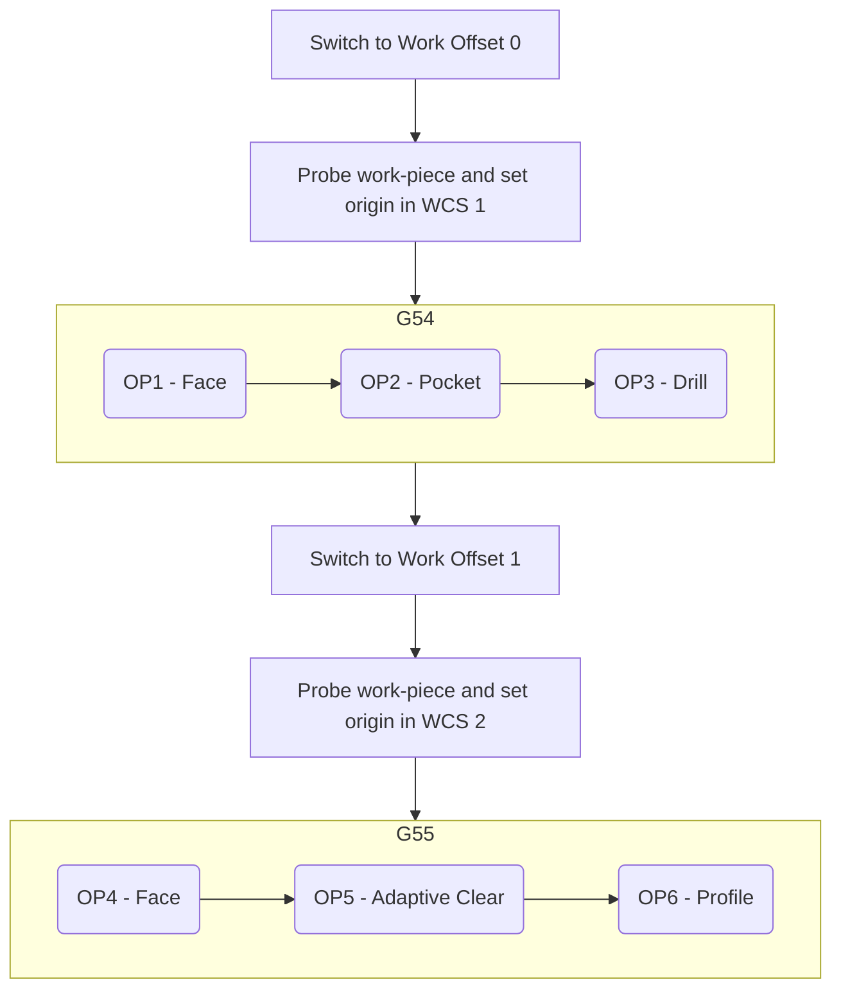

!!! warning
    You can clearly see here the "mismatch" between Fusion360 and RRF / DWC - **Work Offset 0** in Fusion360 corresponds to **WCS 1** in DWC (the offset is *from the first WCS* rather than from *G53, or Machine Co-ordinates*). This is because we do not allow code in machine co-ordinates to be outputted.

    You need to remember this when setting your work offset value in Fusion360 or setting your WCS origins manually.

---

The post-processor defaults to this method of output - this is the **"On Change"** value of the **"WCS Origin Probing Mode"** setting under the **"Probing and inspection"** tab of the **"Post properties"**.

{: .shadow }

With this mode selected, the post-processor will request a work-piece probing cycle for the WCS in question just prior to switching into it.

This is useful for working on a single part where you must rotate the work-piece to machine on multiple faces in sequence. Use the work offset to indicate when a part rotation is necessary, and you can then perform the rotation and probing of the new origin when necessary.

!!! note
    There is currently no way to pass "messages" to RRF to indicate that a work-piece needs to be rotated. You must bear this in mind when producing your tool-paths. When a probing operation is triggered, the spindle will be parked and you will be asked to probe the new WCS. At this point, you should rotate the work-piece and then proceed with the probing steps as indicated.

---

#### Multiple work-piece, multiple operations on a single face of each

The below flow chart indicates running the same machining operations on the same face of multiple work-pieces, e.g. when you want to make 3 identical parts.

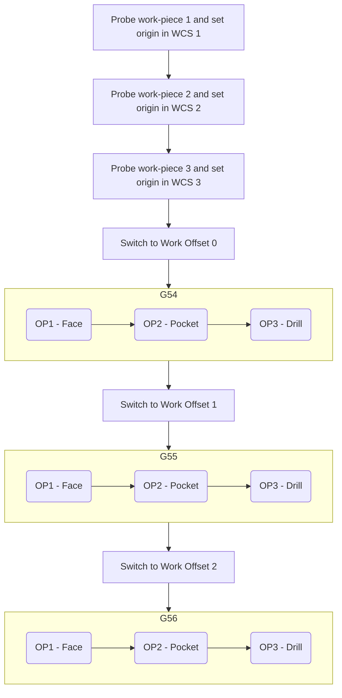

---

This flow corresponds to the **"At Start"** value of the **"WCS Origin Probing Mode"** setting under the **"Probing and inspection"** tab of the **"Post properties"**.

{: .shadow }

With this mode selected, the post-processor will identify all work offsets used in the Setup, and trigger a probing cycle for each of them at the start of the gcode.

This is useful where you want to make multiple identical parts - you can select the **"Multiple WCS Offsets"** tick-box on the **"Setup"**, and indicate how many parts to process - Fusion360 will repeat the operations in each WCS that is probed at the start of the file.

## Probing

Unless you have a paid Fusion360 license, there is no way to tell (or for Fusion360 to _know_) how to probe a work-piece. Different probing operations should be used based on the shape and rotation of the stock, and the operation in question. For this reason, you will be _prompted in RRF_ to select a probe cycle type when a probe cycle is requested.

If you have a paid Fusion360 license, you can switch **"WCS Origin Probing Mode"** in the **"Post properties"** to **"None (Expert  Mode)"** and then configure the relevant probing cycle under the **"Inspection"** tab of the **"MANUFACTURE"** workbench. Please note this is **currently untested**.

When a probe cycle is triggered, you will see the following dialog box, which allows you to select the probing cycle that you would like to use to zero the WCS in question.

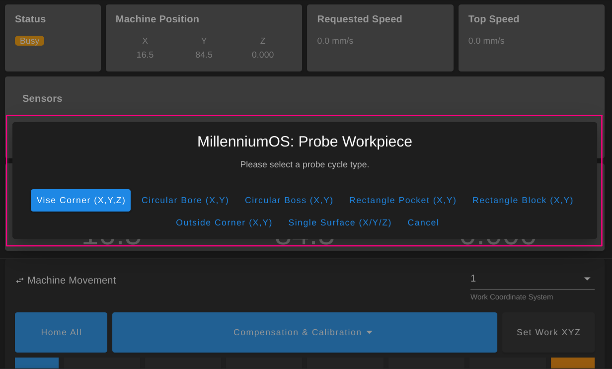{: .shadow-dark }

### Vise Corner

Vise corner is selected by default, as it is likely to be the most-used probing cycle type. With a single probe cycle, it sets a WCS origin in X, Y and Z axes to the top surface of an outside corner of a part.

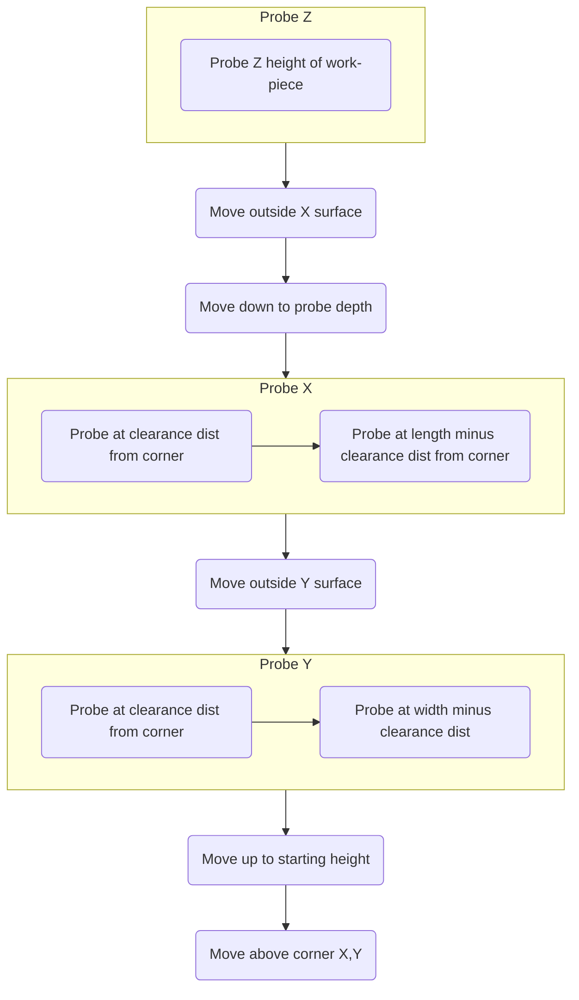

### Circular Bore

Circular bore sets a WCS origin in X and Y axes to the center of a circular bore (hole) in a work-piece. This is usually used to zero off a hole in a partly-machined work-piece, or off a similar feature in a fixture plate.

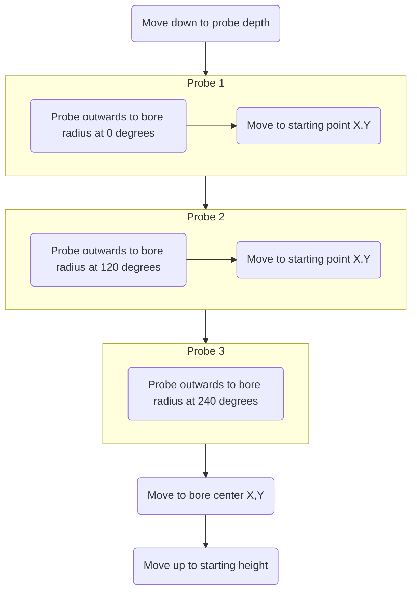

### Circular Boss

Circular boss sets a WCS origin in X and Y axes to the center of a circular boss (protruding feature) in a work-piece. This can be used to zero to the center of a circular work-piece, or a previously-machined circular feature that protrudes from the work-piece surface.

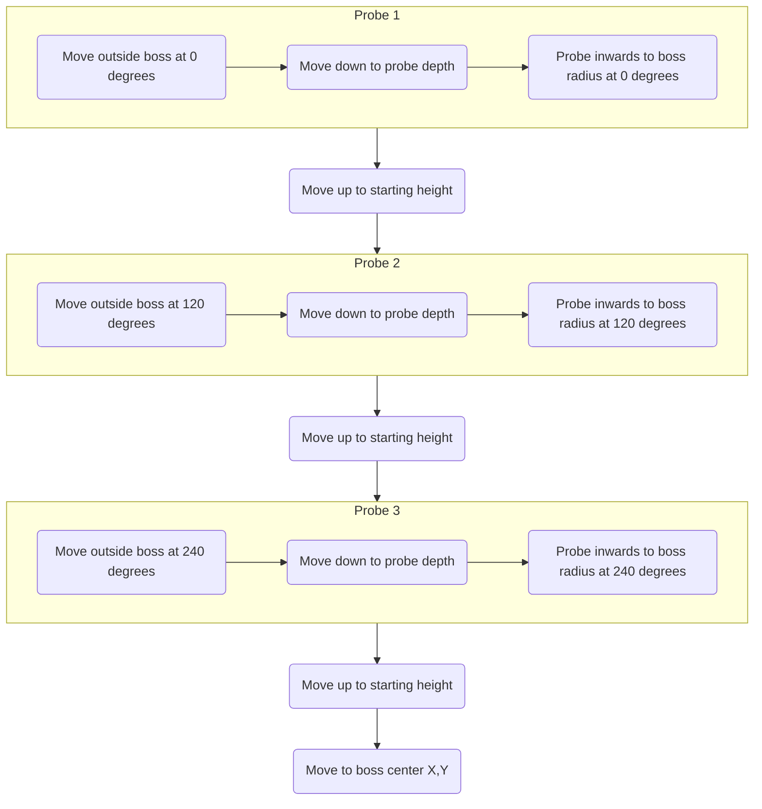

### Rectangle Pocket

Rectangle pocket sets a WCS origin in X and Y axes to the center of a rectangular pocket (subtractive feature) in a work-piece. This is likely to be a previously machined feature. This can be used on pockets that have corner radiuses in X and Y, as long as the clearance distance is higher than the corner radius (so the probe is only triggering against 'flat' surfaces).

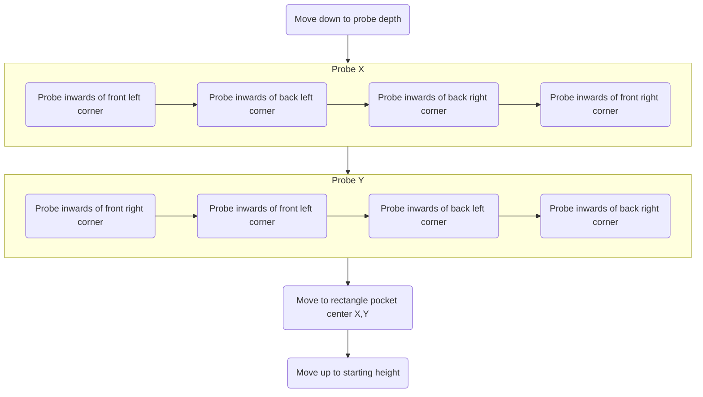

### Rectangle Block

Rectangle block sets a WCS origin in X and Y axes to the center of a rectangular block (protruding feature or a rectangular work-piece itself). This probing cycle is additionally useful for measurement, as it can be used to calibrate touch probes or accurately measure the dimensions of a work-piece.

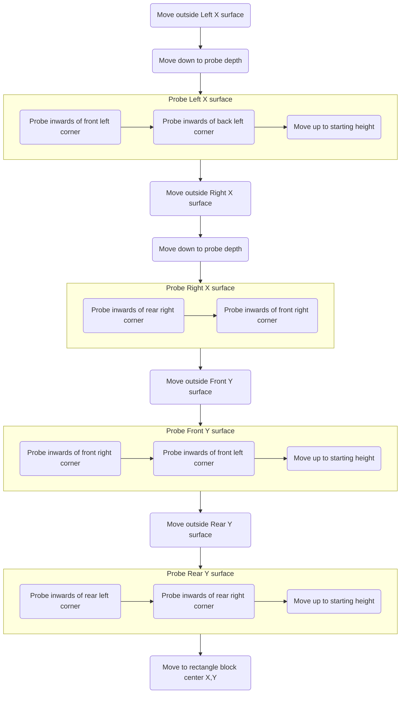

### Outside Corner

Outside corner sets a WCS origin in X and Y axes to the corner of a rectangular work-piece. It is already used by the vise-corner probe cycle, so should only be used in isolation when you need to zero the Z axis somewhere other than the top surface of the work-piece.

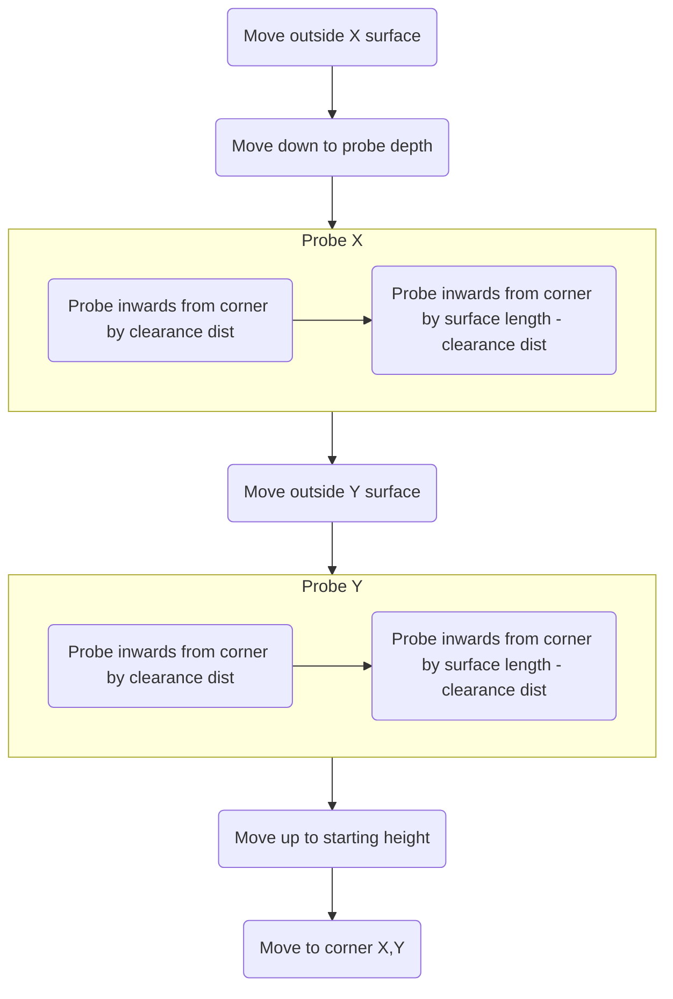

### Single Surface

Single surface can either be used 3 times to probe X, Y and Z axes individually as single points, or to "top up" with a Z probe after using one of the X,Y probe cycles above.

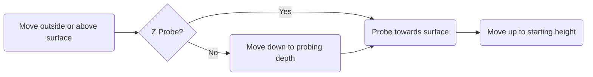

!!! note
    Single surface only probes at a single location. This means it is not possible to estimate the angle of a surface, for example to check if a work-piece is rotated and not aligned with the X or Y axis. It should only be used against surfaces that are known-flat, or surfaces that are *going to be made flat* (in respect to the mounting of the work-piece against the table).

## Tool Changes

As with probing, you will have already experienced a guided tool-change using MillenniumOS when running through the Configuration Wizard. The post-processors supplied with MillenniumOS use the `M4000` command to pass details about the tools required to run a job.

This means that your CAD/CAM program becomes the single source of truth for your tool list, and it can vary based on the job being run.

!!! warning
    The datum tool and optional touch probe you would have chosen during the Configuration Wizard are created and managed by MillenniumOS on each boot. This is important because we need to track the radius and deflection of the touch probe or datum tool for accurate probing results.

    These probe tools exist as a single entry in the tool table, depending on if the touch probe feature is enabled or not. Please do *not* delete this probe tool, or overwrite its index with another tool.

    Probe tools should always exist in the last index of the RRF tool table which is usually ID 49.

At the start of every gcode file, the used tools will be outputted.

When RRF sees a tool change request (`T<N>`, where `<N>` is the tool number), it will trigger the inbuilt RRF tool-change process which calls our custom implementations of `tfree.g`, `tpre.g` and `tpost.g`.

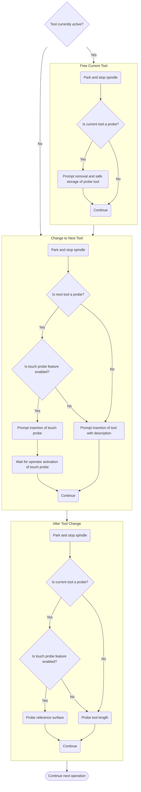

!!! warning
    Any errors that occur during the tool change will abort the entire job that the tool change ran in. This is important, because a failed tool change leaves the machine in an inconsistent state and further machining could cause damage to your tool, work-piece, yourself or your machine.

    Machining is not like 3D printing in one very important aspect - stopping a job does not automatically make your work-piece unrecoverable. It is better to abort for safety purposes and allow you, the operator, to re-run the job or tool change again.

## Variable Spindle Speed Control

This feature is enabled by default, and will adjust the spindle speed up and down within a small range to avoid resonance building up between the work-piece and tool. Disabling this is likely to have a negative impact on machining quality, but the settings can be tweaked through the post-processor properties and it can also be turned on and off and configured for each operation.

When VSSC is active, you may be able to hear the spindle speeding up and slowing down on a regular interval. This is intended.

When VSSC is enabled, it has a `Period` (`P...`) and a `Variance` (`V...`).

VSSC adjusts the spindle speed around the target RPM in a wave, where the peak of the wave is half the Variance above the target RPM and the trough of the wave is half the Variance below the target RPM.

The Period is the length of one full wavelength, so a change in speed from the target RPM up to the peak RPM, down to the trough RPM and back to the target RPM will take `P...` milliseconds.

*[WCS]: Work Co-ordinate System
*[RRF]: RepRapFirmware
*[DWC]: Duet Web Control
*[VSSC]: Variable Spindle Speed Control
