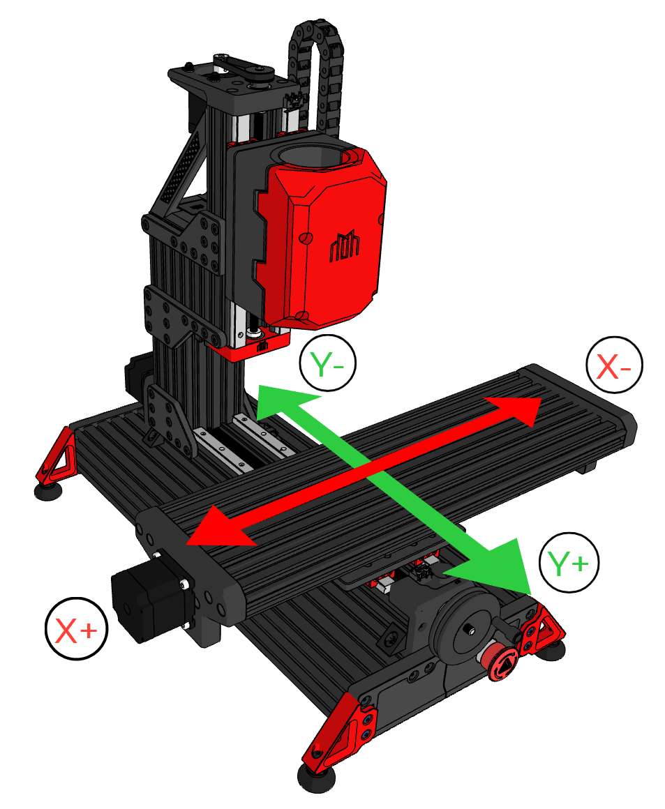

# Pre-Flight Checks

## Axis Directions

Axes movements are based on relative spindle movements and not the movement of the work table.

This will likely be confusing for new users, but to simplify the setup process we've created a diagram based on the
table movement instead. Use this as a reference to set up your axes direction in your `config.g` file.

For your Z-Axis the spindle should move up for Z+ and down for Z-.

{: .shadow}

<!-- This diagram is plainly wrong given the above context. -->

---

## Endstop Query

Ensure that all your endstops are working correctly. To do this, hold each endstop individually and enter
`M119` in the Duet web control console. If it does not return as triggered,
then check your wiring and or your endstop setup in config.g.

---

## Homing Check

Ensure all your homing routines in `homeall.g`, `homex.g`, `homey.g` and `homez.g` work appropriately. You should ensure your `Z` routine works first by running `G28 Z` from the console or clicking the 'Home Z' button in Duet Web Control. Once `Z` homes correctly, you can test `X` and `Y`, and finally use the 'Home All' button or simply `G28` in the console.

---

## Steps-per-mm Calibration

You must ensure that when you move your axes X amount of millimeters it moves X amount of millimeters exactly.

If you do not know how to do this you can follow this [guide](https://teachingtechyt.github.io/calibration.html#xyzsteps).

---

## Check Backlash Compensation

Using an indicator, check all your axes for backlash by moving them back and forth and checking for variance.

If you are not happy with the amount of backlash then you can snug up the Anti-backlash nuts.

---

## Tram Work Surface

Make sure you tram your spindle appropriately to your work table.

If you are using a fixture, tram your spindle to that instead.

---

## Spindle Speed Control

First, ensure your VFD is set up correctly according to its manual.

!!! tip
    If you want to test your spindle, ensure you have removed the collet and collet nut or that you have fitted a suitable tool or dowel pin and torqued the nut. 

Then ensure to set your max spindle speed in `config.g`. Under the spindle section of your config find
the line beginning with `M950` and change the value found after `L` to your maximum spindle speed e.g. `L24000`.

!!! note
    If you are using one of our predefined RRF configurations for a particular hardware specification (such as the LDO kit), this has been done for you already. You only need to ensure that enabling the spindle in Duet Web Control and changing the RPM setting starts and stops the spindle and controls the RPM effectively.

---

## Verifying Spindle Rotation

Before you can start cutting material, you need to make sure that the spindle is wired correctly and is rotating in the proper direction.

Using a 6mm gauge pin (there should be one included in the LDO kit) draw adraw a stright line ~10mm down the side of the gauge pin and insert it into a 6mm collet in your spindle. 

!!! note
    Make sure to snugly tighten the gauge pin in the spindle before processing to the next step

Set your spindle to 10k RPM and then turn it off and watch the rotation of the line as the spindle slows down.  

- If the line on the gauge pin is going from right to left ( <-- ), your spindle is rotating in the right direction.  
- If the line is going from left to right ( --> ), the spindle is rotating in the wrong direction and you will need to flip two wires in the UVW set coming from the spindle.

---

## Grease EVERYTHING

If you have not done so yet make sure that all lead-screws and rails are appropriately greased and or oiled.

A good quality lithium grease (e.g. EP2) is recommended for this job.

---

!!! success ":fontawesome-solid-champagne-glasses: Congratulations!"
    With your pre-flight checks completed, you are now ready to use your machine.
    Record a video of your first cut and submit it on our [Discord](https://discord.gg/ya4UUj7ax2) to receive your serial number!
